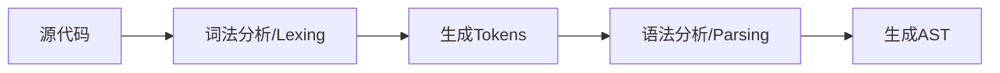
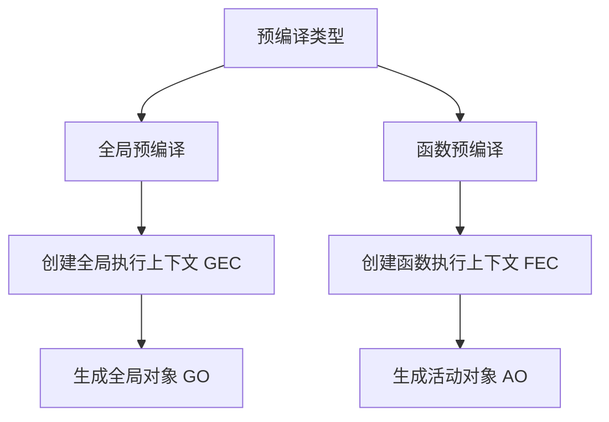
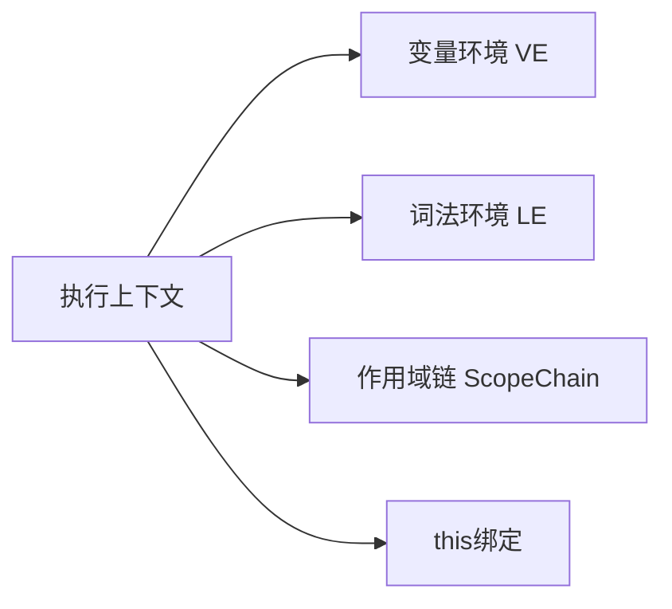
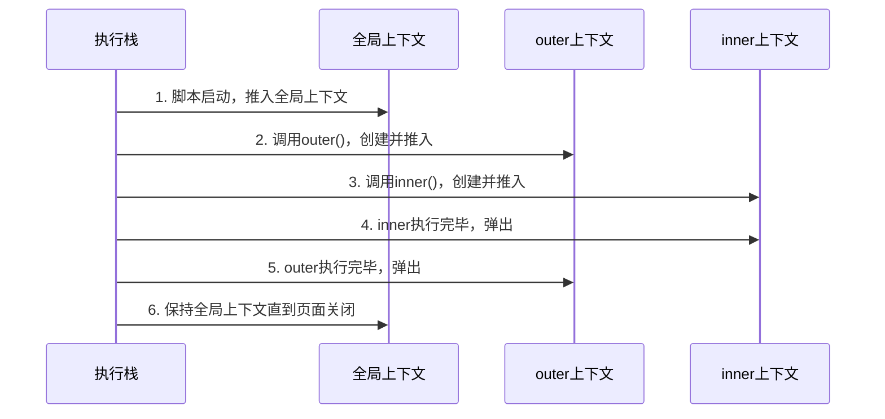

# JavaScript 执行原理 -- 上篇

## 前言

本篇是合集（JavaScript 执行原理）的上篇，全文将详细阐述 JavaScript 执行原理的三大阶段以及由此引出的诸多概念。我们重点要关注**预编译阶段**，这也是许多开发者容易产生困惑的地方。

通过本篇的学习，你将：

- [x] 了解JavaScript 执行的三个阶段
- [x] 深入掌握预编译机制
- [x] 理解执行上下文和变量提升等


### 合集目录

1. **JavaScript 执行原理 -- 上篇**（当前篇）
   - 执行上下文 | JS执行三阶段 | 变量提升

2. **JavaScript 执行原理 -- 下篇**
   - 暂时性死区 | 作用域链 | this 绑定

## JavaScript运行三阶段

在浏览器中执行 JavaScript 代码时，引擎并非直接逐行执行代码，而是会经历三个关键阶段：

1. 语法分析（Syntax Parsing）
2. 预编译（Pre-Compilation）
3. 解释执行（Interpretation）

### 语法分析阶段（Syntax Parsing）

**核心任务**

将源代码转换为计算机可理解的抽象语法树（AST），主要流程：



**关键过程详解**

1. 词法分析（Lexing）
   
```javascript
// 原始代码
const x = 10 + 20;

// 生成的Tokens示例：
[
  { type: 'Keyword', value: 'const' },
  { type: 'Identifier', value: 'x' },
  { type: 'Punctuator', value: '=' },
  { type: 'Numeric', value: '10' },
  { type: 'Punctuator', value: '+' },
  { type: 'Numeric', value: '20' },
  { type: 'Punctuator', value: ';' }
]
```

2. 语法分析（Parsing）

- 使用 [递归下降算法](https://zh.wikipedia.org/zh-hans/%E9%80%92%E5%BD%92%E4%B8%8B%E9%99%8D%E8%A7%A3%E6%9E%90%E5%99%A8) 构建AST
- 验证语法合法性
- 生成标准ESTree结构

::: info
很可惜，我对递归下降算法也没有研究的很透彻，留待以后吧😀
:::

3. AST示例

```json
{
  "type": "Program",
  "body": [
    {
      "type": "VariableDeclaration",
      "declarations": [
        {
          "type": "VariableDeclarator",
          "id": { "type": "Identifier", "name": "x" },
          "init": {
            "type": "BinaryExpression",
            "left": { "type": "Literal", "value": 10 },
            "operator": "+",
            "right": { "type": "Literal", "value": 20 }
          }
        }
      ],
      "kind": "const"
    }
  ]
}
```
语法分析阶段还会检测 ​SyntaxError 这类语法错误。语法错误均在 **​代码执行前** 被检测到。引擎在生成抽象语法树（AST）时，若发现结构不合法，会立即抛出错误并终止后续流程。

> [!NOTE] 重要
> 这种错误有点类似于 Java 等编译前错误。实际上现在语言已经不能简单归类编译型和解释型，大部分都会进行编译、执行前扫描优化。

注意这类错误发生在运行前，我们是无法用try...catch 能捕获到这类错误的。

```js
try {
  eval('function() {}'); // 语法错误
} catch (e) {
  // 此处代码不会执行
}
```

因此，我们在控制台看到的这类错误总是提示 "Uncaught SyntaxError:....."

总的来说，语法分析阶段是 JavaScript 代码质量的第一道防线，所有 ​SyntaxError 均在此阶段被拦截，开发者需依赖工具提示和静态代码检查及时修复。

### 预编译阶段（Pre-Compilation）

预编译阶段发生在代码执行前，是JavaScript最独特的机制，决定了**变量提升**、**作用域链**等核心特性的行为模式。理解这个阶段，就能解开90%的"诡异"代码现象。​

预编译阶段大致示意图：



这一阶段 JavaScript 引擎采用分层编译策略完成核心任务：
   - 全局预编译 
   - 函数预编译

我们先把 全局预编译 和 函数预编译 分别讲清楚。

#### 全局预编译（Global Pre-Compilation）

**​触发时机**：脚本加载时立即执行

**​核心产出**：
- 创建全局执行上下文（Global Execution Context, GEC）
- 生成全局对象（Global Object，浏览器中即 window）

**主要工作**：
- 扫描所有 var 声明的全局变量（初始值为 undefined）
- 处理函数声明（整体提升）

##### 构建全局执行上下文

全局执行上下文类似如下结构：

```js
GlobalExecutionContext = {
    VariableEnvironment: {
        EnvironmentRecord: GO,
        outer: null
    },
    LexicalEnvironment: {
        EnvironmentRecord: {
            // let/const声明（此时未初始化）
        },
        outer: null
    },
    ThisBinding: GO.window
}
```
我们可以看到 GO 也就是全局对象是被关联在 **变量环境** 中的。

##### GO创建过程

1. 创建GO对象。这个过程分三步：
    1. 创建空对象： `GO = new Object()`
    2. 内置属性注入
    ```js
    GO = {
        // 内置属性和方法
        window: this,
        document: {},
        Array: function(){},
        Object: function(){},
        String: function(){},
        Boolean: function(){},
        Date: function(){},
        Math: {},
        // ... 其他内置属性和方法
    }
    ```
    3. 建立循环引用 `GO.window = GO  // 浏览器环境特有问题`

2. 处理变量声明（var）

```js
// 找到所有var声明，添加到 GO 中并初始化为 undefined
var a = 1;
var b = function() {};
// 变为：
GO = {
    // ...内置属性
    a: undefined,
    b: undefined
}
```

3. 处理函数声明

```js
function test() {}
// 变为：
GO = {
    // ...内置属性
    test: function test() {}
}
```

特殊情况处理：

1. 函数声明具有高优先级 

```js
var demo = 'variable';
function demo(){} 
console.log(typeof demo); // "function"（函数声明优先）
```

有的人可能会问：如果 demo 变量的声明在函数声明后边会咋样？

```js
function demo(){} 
var demo
console.log(typeof demo); // "function"（函数声明优先）
```

**规则是**：函数的声明始终优先，但也仅限于声明。当 `var demo` 在函数声明后边，这个时候函数声明依然优先。demo仍然是指向fn。但是如果是 `var demo = 'a'` 这个时候就得注意了，函数声明虽然优先了，但是赋值操作不优先，这个时候demo 会被赋值 `'a'`，实际把变量给 “盖了”

::: tip 提示
- 注意赋值操作是在执行阶段，不属于预编译阶段。上面代码打印的实际是执行结果，所以 demo 是 a
- 一定要谨记：函数是 JS 的第一等公民
:::

现在我来提 2 个问题来加深思考。

问题1： 下面的代码中函数能正常执行吗？
```js
console.log(greet()); 
function greet() {
    return 'Hello!';
}
```

::: details 思考片刻再看答案会更好额！
答案是： 当然可以正常执行！ 
思路很简单：预编译阶段在代码执行之前，而在预编译阶段，函数声明就已经提升了！ 是不是很神奇？
:::

如果你能答出来说明你已经摸到 `变量提升` 的门槛了！🥰 

问题2： 下面的代码中 `version` 打印的是什么？

```js
console.log(version); 
var version = 1.0;
```

::: details 思考片刻再看答案会更好额！
答案是： 打印的值是 `undefined` 
思路很简单：预编译阶段变量会得到提升，`version` 会被处理成 GO 的一个属性并且初始化为 `undefined`
:::

上面2道小题实际上已经很好的解释了什么是 `变量提升`。它更像是一个表现结果，而不是某个深层次的概念。

#### 函数预编译（Function Pre-Compilation）

**触发时机**：每次函数调用前（包括递归调用）

**​核心产出**：
- 创建函数执行上下文（Function Execution Context, FEC）
- 生成活动对象（Activation Object, AO）

**​处理内容**：
- 处理形参声明（创建参数属性）
- 扫描函数体内 var 声明的变量
- 处理函数声明（整体提升）

##### 构建函数执行上下文

函数执行上下文结构如下：

```js
FunctionExecutionContext = {
    VariableEnvironment: {
        EnvironmentRecord: AO,
        outer: [[Scope]] // 指向父级作用域
    },
    LexicalEnvironment: {
        EnvironmentRecord: {
            // let/const声明（此时未初始化）
        },
        outer: [[Scope]]
    },
    ThisBinding: 动态绑定
}
```

##### AO创建过程

函数预编译的核心是创建活动对象（AO），其构建流程分为四个关键步骤：

1. 创建AO（Activation Object）对象

```JS
AO = {
    arguments: {
        length: 0,
        // 参数映射（非严格模式下与形参绑定）
    },
    // 其他属性将在后续步骤添加
}
```

2. 变量提升

   1. 所有var声明的变量 + 形参 添加为AO属性
   2. 初始值设为 `undefined`

2. ​处理形参    
   
   1. 接收实参值并赋给形参 (形实合一)
   2. 未传值的参数仍然还是 `undefined` 

4. 处理函数声明

   1. 函数名作为AO属性
   2. 属性值为函数体引用（整体提升）

::: tip 提示
注意：函数声明仍然具有高优先级
:::

现在我们用一个小例子来加深理解：

::: code-group

```js [demo.js]
function demo(a, b) {
    var c = 30;
    function inner() {}
    var d = function() {};
}
demo(10);
```

```js [complied.js]
AO = {
    arguments: {
        0: 10,
        1: undefined,
        length: 2,
        callee: demo // 函数自身引用
    },
    a: 10,           // 形参接收实参值
    b: undefined,    // 未传递的形参
    c: undefined,    // var声明变量
    d: undefined,    // var声明变量（函数表达式不提升）
    inner: function inner() {} // 函数声明整体提升
}
```
:::

稍微说明一下这个例子：

1. 形参 a，b + var 变量 c，d 被提升到 AO 的属性并置为 undefined。 （注意这里 d 这行是表达式而不是函数声明）
2. 形实合一，这里就是把 10 赋给 a
3. 函数提升，这个无异议

### 执行阶段（Execution Phase）

在预编译阶段完成上下文创建后，引擎进入顺序解释执行阶段。这个阶段比较简单，我们了解下其核心任务就行：

- 执行赋值操作
- 处理函数调用
- 完成表达式计算
- 处理控制流语句

```js
// 示例：执行阶段特征
let count = 0;
function calculate() {
    const base = 10;
    count = base * 2; // 赋值操作在此时执行
    if (count > 15) {  // 控制流判断
        console.log('触发条件分支');
    }
}
calculate(); // 函数调用触发新上下文创建
```
 
好了，到这里我们的 JS 执行的三大阶段的大致梗概基本完结了。从上面也可以看出整个过程的关键在于执行上下文（EC），我们看到的各种 GO、AO 都是关联在 EC中的，EC 就好像是 JS 引擎管理代码运行的容器，记载了运行时的各种环境信息。

下面我们来具体探讨一下执行上下文

## 执行上下文

**执行上下文（Execution Context）** 是JavaScript 引擎管理代码执行的核心机制。

JS 引擎在管理一段代码时候，往往会生成多个执行上下文。这些执行上下文以后进先出（LIFO）的结构来管理、追踪函数调用关系。这种结构我们称之为**执行上下文栈（Execution Context Stack）**，也叫 **调用栈（Call Stack）**。

执行上下文栈是确保代码在正确的作用域和上下文中执行的关键。

并非只有函数执行才会生成上下文。总的来说，有下面几种情况：

1. 全局代码（Global Code）​
   
   1. 何时生成：脚本首次运行时
   2. ​特点：全局上下文是整个程序的入口，始终位于执行栈底部

2. 函数调用（Function Call）​
   
   1. ​何时生成：​每次调用函数时​（包括递归调用），无论函数是声明式、表达式还是箭头函数
   2. ​特点：函数上下文入栈执行，执行完毕后出栈
   ```js{6}
   function bar() {
    // 每次调用 bar() 时，生成新的执行上下文
    console.log("bar 执行中");
    }
    bar(); // 第一次调用，生成上下文
    bar(); // 第二次调用，再次生成新上下文 !!
    ```
3. eval 代码（极少使用）​
   1. 这种是执行字符串代码，会生成一个临时上下文
   2. 最好少用这种模式，不仅不安全，而且执行效率也不好

::: warning 警告
ES6 的块级作用域（Block Scope）不会生成执行上下文。这是很多人误解的地方。实际上，块级作用域通过 `​词法环境（Lexical Environment）`​ 管理，而非执行上下文栈。
:::

稍微总结一下：
| 场景               | 是否生成执行上下文 | 说明                             |
| ------------------ | ------------------ | -------------------------------- |
| 全局代码执行       | ✅                  | 仅生成一次，位于栈底             |
| 函数调用           | ✅                  | 每次调用生成新的上下文           |
| `eval()` 执行      | ✅                  | 临时上下文（不建议使用）         |
| 块级作用域（`{}`） | ❌                  | 通过词法环境处理，不触发上下文栈 |

::: details 扩展延申
- 在浏览器环境中，多个 `<script>` 标签加载的脚本默认情况下是共享同一个全局执行上下文的，他们共享全局变量
- 即使脚本来自不同域，只要加载到页面中，仍共享同一全局上下文（受同源策略限制的是数据请求，而非脚本执行）
- 模块化脚本（type="module"）首次加载会创建独立执行上下文，​不共享全局变量。但是其他模块导入同一个模块时候，会复用已有模块实例，不会再来一个上下文
:::

执行上下文有下面几个关键部分组成：



- **​变量环境 Variable Environment**​：存储 var 声明的变量和函数声明（存在变量提升）
- **​词法环境 Lexical Environment**​：处理 let、const 声明的变量和块级作用域
- **​作用域链 Scope Chain**​：用于变量查找的链式结构
- ​**this 绑定**：指向当前执行环境的上下文对象

下面是执行上下文的结构伪码

```js
ExecutionContext = {
    // 变量环境组件：存储var声明的变量和函数声明
    VariableEnvironment: {
        // 环境记录：存储变量和函数声明的实际位置
        EnvironmentRecord: {
            Type: "Object",  // 用于全局上下文
            // 或者 Type: "Declarative" // 用于函数上下文
            // 绑定标识符
            bindings: {
                // 变量和函数声明都存储在这里
            }
        },
        outer: null  // 对外部环境的引用
    },

    // 词法环境组件：处理let/const声明和块级作用域
    LexicalEnvironment: {
        EnvironmentRecord: {
            Type: "Declarative",
            // 存储let、const声明
            bindings: {}
        },
        outer: null  // 对外部词法环境的引用
    },

    // this绑定
    ThisBinding: null,

    // 作用域链
    ScopeChain: []  // 由当前环境和所有外部环境的词法环境组成
}
```

我们前面看到的 全局执行上下文 和 函数执行上下文其实都是它的特例。

::: warning 警告
真实的执行上下文是引擎内部实现机制，无法直接用代码访问，故而我们上面用伪码表示，但是不影响我们的理解
:::

## 执行上下文的生成过程

通常一段代码既有全局执行上下文，也有函数执行上下文。我们来综合来看一下



我们通过一段具体的代码来说明这个过程。

::: code-group

```js [demo.js]
var name = 'global';
let age = 25;

function outer() {
    var name = 'local';
    let hobby = 'coding';
    
    function inner() {
        const type = 'inner';
        console.log(name, hobby, type);
    }
    
    inner();
}

outer();
```

```js [全局执行上下文]
GlobalExecutionContext = {
    VariableEnvironment: {
        EnvironmentRecord: {
            Type: "Object",
            bindings: {
                name: "global",
                outer: <function>
            }
        },
        outer: null
    },
    LexicalEnvironment: {
        EnvironmentRecord: {
            Type: "Object",
            bindings: {
                age: 25
            }
        },
        outer: null
    },
    ThisBinding: window,
    ScopeChain: [GlobalLexicalEnvironment]
}
```

```js [outer函数执行上下文]
outerExecutionContext = {
    VariableEnvironment: {
        EnvironmentRecord: {
            Type: "Declarative",
            bindings: {
                name: "local",
                inner: <function>
            }
        },
        outer: GlobalVariableEnvironment
    },
    LexicalEnvironment: {
        EnvironmentRecord: {
            Type: "Declarative",
            bindings: {
                hobby: "coding"
            }
        },
        outer: GlobalLexicalEnvironment
    },
    ThisBinding: window, // 默认绑定
    ScopeChain: [PersonLexicalEnvironment, GlobalLexicalEnvironment]
}
```

```js [inner函数执行上下文]
innerExecutionContext = {
    VariableEnvironment: {
        EnvironmentRecord: {
            Type: "Declarative",
            bindings: {}
        },
        outer: PersonVariableEnvironment
    },
    LexicalEnvironment: {
        EnvironmentRecord: {
            Type: "Declarative",
            bindings: {
                type: "inner"
            }
        },
        outer: PersonLexicalEnvironment
    },
    ThisBinding: window,
    ScopeChain: [DisplayNameLexicalEnvironment, PersonLexicalEnvironment, GlobalLexicalEnvironment]
}
```
:::

上面这段代码会创建3个执行上下文。 首先，进入全局代码生成全局上下文，在 `outer()` 函数调用的时候生成outer函数的执行上下文，再依次生成 `inner()` 函数的执行上下文。

这里一定要注意的是：函数 **执行** 才会生成上下文 ❗❗

## 小练习

下面我们来个小测验，也是面试常见的“人工走代码”问题，如果你能答出来，说明这篇掌握的不错！🤩

```js
console.log(a);  
var a = 1;
function test(a) {
    console.log(a);  
    var a = 2;
    function a() {}
    console.log(a);  
}
test(1);
```

::: details 解题思路
```
GO = {
    a: undefined --> 1,
    test: function(){}
}

AO = {
    a: undefined --> 1 --> function a(){} -> 2 
}
```
注意：AO阶段的 `a = 2` 是执行期赋值，其他是预编译期。声明会被提前，但赋值仍在原地
:::

::: details 答案
```js
console.log(a);  // undefined
var a = 1;
function test(a) {
    console.log(a);  // function a() {}
    var a = 2;
    function a() {}
    console.log(a);  // 2
}
test(1);
```
:::

## 总结

本篇主要学习了 JS 执行的预编译阶段，重点掌握了变量提升这种诡辩现象。引出了重量级概念 执行上下文。
下一篇我们要把执行上下文的其他组成部分和 JS 执行的最后一个阶段讲完。
