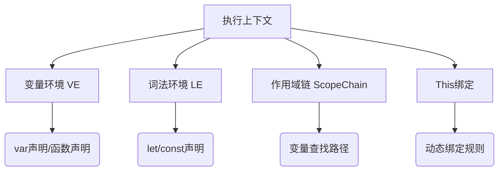

# JavaScript 执行原理 -- 下篇

## 前言

本篇是合集（JavaScript 执行原理）的下篇，这篇我会把执行上下文的组成部分都讲完，包括最重要的**作用域链**。

通过本篇的学习，你将：

- [x] 了解作用域链
- [x] 理解暂时性死区
- [x] 理解 this 绑定

### 合集目录

1. **JavaScript 执行原理 -- 上篇**
   - 执行上下文 | JS执行三阶段 | 变量提升
  
2. **JavaScript 执行原理 -- 下篇**（当前篇）
   - 暂时性死区 | 作用域链 | this 绑定

## 正文

我们先用一个示意图将执行上下文的组成部分列举出来然后分门别类的说清楚



变量环境其实在上篇已经涉及的比较多了。但是这里我还是再提一下。

**VariableEnvironment**

  - 作用：存储 var 声明的变量和函数声明（Function Declarations）
  - 特点：
    - 在创建阶段（Creation Phase）初始化，值被设为 `undefined`（变量提升的根源）
    - 在同一个函数/全局作用域内，var 变量和函数声明会被绑定到 VariableEnvironment
    - 不会随块级作用域变化（如 {}），因此 var 声明的变量在块外仍可访问

**LexicalEnvironment**

  - 作用：存储 let、const 声明的变量、块级作用域（如 {}）以及 this 绑定
  - 特点：
    - 初始时，LexicalEnvironment 与 VariableEnvironment 指向同一个环境（Environment Record）
    - 如果遇到块级作用域（如 {}），会创建一个新的 Lexical Environment，并将 outer 指向到外部的 Lexical Environment

## 特殊的 `[[scope]]` 属性

当一个函数被定义时，JavaScript引擎会创建一个函数对象，并为其添加内部属性 `[[Scope]]`。
`[[Scope]]` 的值是 **函数定义时** 所在环境的词法环境（Lexical Environment）的引用。

下面用一个小例子详细说明

```js
function outer() {
  const a = 10;
  function inner() { 
    console.log(a); 
  }
  return inner;
}

const innerFunc = outer();
innerFunc(); // 输出 10
```

1. 定义阶段：

- outer 的 `[[Scope]]` 被设置为全局词法环境。
- inner 的 `[[Scope]]` 尚未确定，因为 inner 的定义代码还未执行。

2. 运行时：

- 调用 `outer()`，创建 outer 的执行上下文，变量 `a=10` 被添加到 outer 的词法环境
- 执行到 `function inner() { ... }`，此时 inner 被定义，其 `[[Scope]]` 被设置为 outer 当前的词法环境（包含 `a=10`）

这里有2点需要注意： 
- 内部函数的定义是在外部函数执行的时候才开始的
- 它的 `[[Scope]]` 实际上是一个静态作用域（函数定义时就决定的）
- 同时它的 `[[Scope]]` 具体值又取决于定义代码执行时所在的外层词法环境

> [!IMPORTANT]
> 如果你足够敏锐的话，你会发现这几点正是闭包的核心机制

## 执行上下文的作用域链

执行上下文的在创建的时候也会构建 **作用域链（Scope Chain）**，过程如下：

- 复制函数的 `[[Scope]]` 属性（函数定义时就确定的静态作用域）
- 将活动对象添加到作用域链前端：`scopeChain = [AO].concat([[Scope]])`

::: info
注意不是真复制，只需要将引用链起来就行
:::

下面用一个小例子解释下具体步骤：

```js [demo.js]
var globalVar = 'global';

function outer() {
    var outerVar = 'outer';
    
    function inner() {
        var innerVar = 'inner';
        console.log(innerVar);    // 查找顺序：inner AO → outer AO → GO
        console.log(outerVar);    // 查找顺序：inner AO → outer AO → GO
        console.log(globalVar);   // 查找顺序：inner AO → outer AO → GO
    }
    
    inner();
}

outer();
```

**作用域链构建过程**:

1. 全局上下文创建：

   - GO: { globalVar: `undefined`, outer: function }
   - ScopeChain: [GO]
  
2. outer函数调用：
   
   - outer AO: { outerVar: `undefined`, inner: function }
   - outer.[[Scope]] = [GO]
   - outer ScopeChain: [outer AO, GO]
  
3. inner函数调用：

   - inner AO: { innerVar: `undefined` }
   - inner.[[Scope]] = [outer AO, GO]
   - inner ScopeChain: [inner AO, outer AO, GO]
