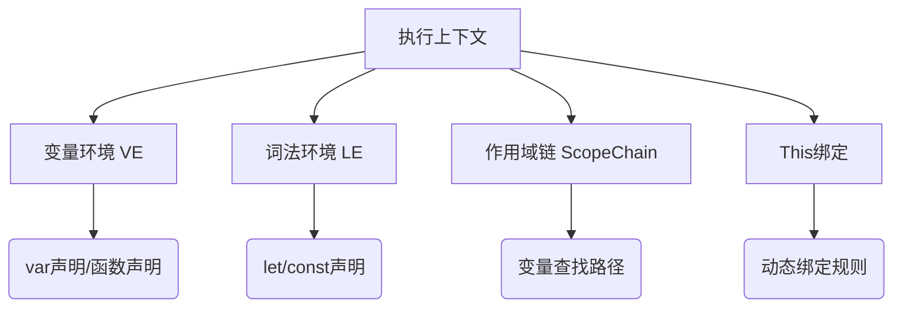
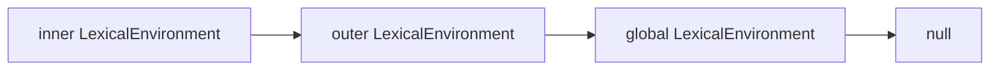

# JavaScript 执行原理 -- 下篇

## 前言

本篇是合集（JavaScript 执行原理）的下篇，这篇我会把执行上下文的组成部分都讲完，包括最重要的**作用域链**。

通过本篇的学习，你将：

- [x] 了解作用域链
- [x] 理解暂时性死区
- [x] 理解 this 绑定

### 合集目录

1. **JavaScript 执行原理 -- 上篇**
   - 执行上下文 | JS执行三阶段 | 变量提升
  
2. **JavaScript 执行原理 -- 下篇**（当前篇）
   - 暂时性死区 | 作用域链 | this 绑定

## 正文

我们先用一个示意图将执行上下文的组成部分列举出来然后分门别类的说清楚



变量环境其实在上篇已经涉及的比较多了。但是这里我还是再提一下。

**VariableEnvironment**

  - 作用：存储 var 声明的变量 和 函数声明
  - 特点：
    - 在预编译阶段，var 变量被提升且值被设为 `undefined`（变量提升的根源）
    - 在同一个函数/全局作用域内，var 变量和函数声明会被绑定到 VariableEnvironment
    - 不会随块级作用域变化（如 {}），因此 var 声明的变量在块外仍可访问

**LexicalEnvironment**

  - 作用：存储 let、const 声明的变量、块级作用域（如 {}）
  - 特点：
    - 初始时，LexicalEnvironment 与 VariableEnvironment 指向同一个对象（Environment Record）
    - 如果遇到块级作用域（如 {}），会创建一个新的 `LexicalEnvironment`，并将其 outer属性 指向外部的 `LexicalEnvironment`

## 特殊的 `[[scope]]` 属性

当一个函数被定义时，JavaScript引擎会创建一个函数对象，并为其添加内部属性 `[[Scope]]`。
`[[Scope]]` 的值是 **函数定义时** 所在环境的词法环境（Lexical Environment）的引用。

下面用一个小例子详细说明

```js
function outer() {
  const a = 10;
  function inner() { 
    console.log(a); 
  }
  return inner;
}

const innerFunc = outer();
innerFunc(); // 输出 10
```

1. 定义阶段：

- outer 的 `[[Scope]]` 被设置为全局词法环境。
- inner 的 `[[Scope]]` 尚未确定，因为 inner 的定义代码还未执行。

2. 运行时：

- 调用 `outer()`，创建 outer 的执行上下文，变量 `a` 被添加到 outer 的词法环境
- 执行到 `function inner() { ... }`，此时 inner 被定义，其 `[[Scope]]` 被设置为 outer 当前的词法环境（包含 `a`）

这里有2点需要注意：

  - 内部函数的定义是在外部函数执行的时候才开始的
  - 函数的 `[[Scope]]` 实际上是一个静态作用域（函数定义时就决定的）
  - 同时 `[[Scope]]` 具体值又取决于定义代码执行时所在的外层词法环境

> [!IMPORTANT]
> 如果你足够敏锐的话，你会发现这几点正是闭包的核心机制

## 执行上下文的作用域链

执行上下文的在创建的时候也会构建 **作用域链（Scope Chain）**，过程如下：

- 复制函数的 `[[Scope]]` 属性（函数定义时就确定的静态作用域）
- 将活动对象添加到作用域链前端：`scopeChain = [AO].concat([[Scope]])`

::: info
注意不是真复制，只需要将引用链起来就行
:::

下面用一个小例子解释下具体步骤：

```js [demo.js]
var globalVar = 'global';

function outer() {
    var outerVar = 'outer';
    
    function inner() {
        var innerVar = 'inner';
        console.log(innerVar);    
        console.log(outerVar);    
        console.log(globalVar);   
    }
    
    inner();
}

outer();
```

**作用域链构建过程**:

1. 全局上下文创建：

   - GO: { globalVar: `undefined`, outer: function }
   - ScopeChain: [GO]
  
2. outer函数调用：
   
   - outer AO: { outerVar: `undefined`, inner: function }
   - outer.[[Scope]] = [GO]
   - outer ScopeChain: [outer AO, GO]
  
3. inner函数调用：

   - inner AO: { innerVar: `undefined` }
   - inner.[[Scope]] = [outer AO, GO]
   - inner ScopeChain: [inner AO, outer AO, GO]

## 作用域链的作用

作用域链是 JavaScript 中变量查找的核心机制，它决定了代码在执行时如何查找变量。具体来说：

**​变量查找规则**：

1. 当访问一个变量时，JavaScript 引擎会沿着作用域链从前往后查找
2. 先在当前执行上下文的变量环境中查找
3. 如果找不到，就向外层作用域查找，直到全局作用域
4. 如果全局作用域也找不到，则抛出 ReferenceError

**​变量屏蔽（Variable Shadowing）​**：

1. 内层作用域可以定义与外层同名的变量，从而"屏蔽"外层变量。（因为是先从内找的）

## ​闭包实现的原理

1. 函数可以记住并访问其词法作用域，即使函数在其词法作用域之外执行，这正是因为作用域链在函数定义时就已经确定了

这里我稍微多说一下闭包，因为这个问题实在太热门了。

```js [closure.js]
function outerFunction() {
    let outerVariable = 'I am from outer scope!';

    function innerFunction() {
        console.log(outerVariable); // 访问外部函数的变量
    }

    return innerFunction; // 返回内部函数
}

const closureFunction = outerFunction(); // 调用外部函数，返回内部函数
closureFunction(); // 输出: I am from outer scope!
```

遇到这种问题，我们来“人工”跑一下代码：

1. 首先加载代码后，肯定是创建 全局执行上下文 及 GO
2. 定义外部函数，`[[Scope]]` 指向全局执行上下文的词法环境引用的对象，也就是 GO
3. 执行外部函数，创建外部执行上下文，作用域链指向 [外部AO, GO]
4. 定义内部函数，`[[Scope]]` 指向 外部执行上下文的词法环境AO
5. 执行内部函数，创建内部执行上下文，作用域链指向 [内部AO, 外部AO, GO]

这里我们可以看到，哪怕内部函数是在外面执行也不影响它访问外部函数的变量，因为这是由定义的时候就决定的。

正常情况下，函数执行完了，应该销毁执行上下文的，但是由于内部函数仍然被 `closureFunction` 所引用，连带相应的作用域链、执行上下文无法销毁。这也是为什么内层函数到了外边依旧能访问原来外层函数的变量的原因！

> [!IMPORTANT]
> 记录函数执行的环境容器（上下文）还在，这是闭包现象的根本原因！！

::: warning 思考1
为什么说闭包容易造成内存泄漏？
:::

::: warning 思考2
如果再次运行 `const closureFunction2 = outerFunction();` 那么这里的执行上下文是同一个吗？
:::

## 暂时性死区（Temporal Dead Zone, TDZ）

暂时性死区（Temporal Dead Zone，简称TDZ）是JavaScript中与let和const变量声明相关的一个重要概念，它描述了从进入作用域到变量声明完成之间的时间段，在这段时间内访问变量会导致引用错误。

基本概念
​定义：TDZ 是指从代码块开始执行到变量被声明之间的区域，在这期间任何尝试访问该变量的操作都会抛出ReferenceError。

​适用变量类型：仅适用于let和const声明的变量，var声明的变量不存在TDZ。

示例：

```js
console.log(myVar); // undefined (变量提升)
var myVar = 'value';

// ReferenceError: Cannot access 'myLet' before initialization
console.log(myLet);
let myLet = 'value';
```

在这个例子中：

  - var声明的变量会被提升到作用域顶部，初始值为 `undefined`
  - let声明的变量也会被提升，但并不置为 `undefined`，它在声明前处于TDZ，访问会导致错误

TDZ的范围是从进入 **作用域**（包括块级作用域）开始，直到变量被声明：

```
{
  // 这里是myVar的TDZ开始
  console.log(myVar); // ReferenceError
  let myVar; // TDZ结束
  console.log(myVar); // undefined
  myVar = 'value';
  console.log(myVar); // 'value'
}
```

为什么会有这么奇怪的规则？

原因很简单，JS 被发明出来的时候实在太简陋了。像 var 变量产生的种种诡异的现象哪怕是一个老手也可能被绕晕，这在其他语言里面也几乎是没有的。比如：

   - 变量提升（Hoisting）违反直觉
   - 允许重复声明容易导致错误
   - 函数作用域不符合块级作用域的通用编程习惯

为了弥补这种缺陷（同时也为了兼容以前的代码），从ES5+ 开始，引入了诸多改进：

   - 提出了 `let` + `const` 新型变量声明
   - 引入块级作用域
   - 函数参数可以指定默认值
   - 禁止声明前使用（更严格的语法检查）

TDZ 就是在这种背景下诞生的！它既保留编译阶段的变量"预扫描"（便于静态分析），又避免 var 式的提升行为（运行时报错而非返回 undefined）😮‍💨

### TDZ 实现的原理

前面我们说到预编译阶段创建执行上下文的时候会把 var 变量提升到 `VariableEnvironment` 里面去（也就是作为 GO、AO 的属性）

那么对于 let、const 等变量是如何处理的？其实很简单，他们被收进了词法环境 `LexicalEnvironment` 中。

简单梳理一下：

1. 将 var 变量 和 函数等提升到 `VariableEnvironment` 中
2. `LexicalEnvironment` 初始指向 `VariableEnvironment` 中的 record
3. 将 let/const 变量提升到 `LexicalEnvironment`，但并不置为 `undefiend`，此时访问会报错 （TDZ）
4. 如果进入块级作用域 （`{}`），那就新生成一个 `LexicalEnvironment` 并用 outer 链起来

::: tip 提示
第四点实际就是块级作用域的原理
:::

下面我们结合一个例子加深理解：

::: code-group
```js [let.js]
for (let i = 0; i < 3; i++) {  
  setTimeout(() => console.log(i)); // 正确输出 0,1,2
}
```
```js [var.js]
for (var i = 0; i < 3; i++) {  
  setTimeout(() => console.log(i)); // 正确输出 2,2,2
}
```
:::

为什么这里用 var 变量就不行，用 let 就可以？
其实很简单，每次进入块级作用域都会新生成一个 `LexicalEnvironment`， 我们每次访问的 i 都是不同层级的变量。而 var 没有块级作用域（只有函数级），访问的是同一个变量。

小总结一下：

TDZ 不是性能优化手段，而是语言安全机制。我们日常开发的时候最好将声明集中放到作用域的顶部。

## This 绑定

JS 的 this 指向问题困扰了很多人，也包括我 😔。 究其原因是这门语言发明仅花了10天。this 的设计借鉴了：

   - Java 的 this 语法形式
   - Scheme 的动态绑定思想
   - Self 语言的原型继承

this 的指向也是跟执行上下文有关系 （这个执行上下文真的是太关键了！）

```c [EC.c]
struct ExecutionContext {
    VariableEnvironment;  // 变量环境
    LexicalEnvironment;   // 词法环境
    ThisBinding;          // this 绑定
};
```

执行上下文创建的时候会通过调用位置的语法特征来确定 this 绑定。也就是说 this 是**运行的时候动态绑定的**。

有下面几种绑定规则，不多，直接全记住：

| 调用模式      | 语法特征           | this 绑定规则                     |
|---------------|--------------------|----------------------------------|
| 方法调用      | `obj.method()`     | 隐式绑定到 `obj`                 |
| 独立函数调用  | `func()`           | 默认绑定（全局/`undefined`）     |
| 构造调用      | `new Constructor()`| 绑定到新创建的对象               |
| 间接调用      | `func.call(ctx)`   | 显式绑定到第一个参数 `ctx`       |

当执行 obj.method() 时，底层大致是这样的：

```js
// 伪代码展示引擎如何处理方法调用
function CallExpression(obj, methodName) {
    // 1. 获取函数引用
    const func = obj[methodName];
    
    // 2. 确定 this 绑定
    const thisValue = obj;
    
    // 3. 设置执行上下文的 ThisBinding
    ExecutionContext.ThisBinding = thisValue;
    
    // 4. 执行函数
    return func();
}
```

JavaScript 选择动态绑定的原因：

   - ​适应原型继承：没有类的概念，需要动态确定上下文
   - ​支持高阶函数：函数作为一等公民需要灵活绑定
   - ​事件驱动模型：需要自动绑定到事件源

下面我们用一个小例子来加深理解：

```js
const obj = {
    name: "Alice",
    say: function() {
        setTimeout(function() {
            console.log(this.name); // this = window/undefined（不是 obj！）
        }, 100);
    }
};
obj.say(); // undefined
```

简单分析一下：
   1. 首先 `obj.say()` 的调用会把 this 绑定到 obj
   2. 问题是定时器内的函数调用其实是个普通调用，那么它的this 其实是 `window/undefined`

动态绑定虽然优点不少，但是同样总让人感到困惑。ES6+ 引入了改进方案:

1. 箭头函数，`() => {}`
   1. 箭头函数没有自己的 this
   2. 它的 this 继承自定义时的外层作用域的 this
   3. 不受 call/apply/bind 的影响

我们还是用相似的例子来说明一下：

```js
const obj = {
    name: "Alice",
    say: function() {
        setTimeout(() => {
            console.log(this.name);
        }, 100);
    }
};

obj.say(); // 输出什么？
```

分析：
   1. 首先 `obj.say()` 的调用会把 this 绑定到 obj
   2. 定时器内的是箭头函数，它用的是外层作用域的 this
   3. 因此这里输出 "Alice"

**常见误区**：

```js
const obj = {
    name: "Alice",
    say: () => {
        console.log(this.name); // this = window（不是 obj！）
    }
};
obj.say(); // undefined（因为 window.name 不存在）
```

我们分析问题的时候时刻谨记上面表格列举的几种绑定方式。上述代码中由于是箭头函数，所以 this 不会指向 obj，而是继承外层作用域的 this（这里是 window，不是obj）。因此推荐我们在写类方法的时候写普通函数就可以了，不要使用箭头函数。

::: info
箭头函数的作用和意义远不止于此，后续文章我们还会讲述更多，这里点到为止
:::

## 额外说明

本篇和上篇在讲执行上下文的结构的时候，同时展示了 `ScopeChain` 和 `LexicalEnvironment`，这个其实是有一点不严谨的。

ES6 以前（准确的说是 ES3 规范）没有 let / const 等，执行上下文里面只有 `VariableEnvironment` 和 `ScopeChain`，其中 `ScopeChain` 是以数组的结构存储的。

```js
ExecutionContext = {
  VO: VariableObject,       // 变量对象（AO/GO）
  ScopeChain: [VO, ...],    // 显式的作用域链（数组）
  thisValue: this
}
```

- ​作用域链（Scope Chain）​ 是执行上下文的一个 ​显式属性，直接存储为数组（如 [当前AO, 父级VO, 全局VO]）。
- ​**[[Scope]]**：函数的内部属性，指向其定义时的父级作用域链（即 父级ExecutionContext.ScopeChain）

ES6 新增了词法环境后，作用域链实际是 词法环境中的 outer 串联起来的链式结构，以前的 `ScopeChain` 已经废弃了。

```c
ExecutionContext = {
  LexicalEnvironment: {     // 词法环境（存储变量 + outer引用）
    EnvironmentRecord: { /* AO/GO */ },
    outer: <父级词法环境>    // 单层引用
  },
  VariableEnvironment: { ... }, // 用于var变量
  thisValue: this
}
```

- 不再直接存储作用域链，而是通过 `LexicalEnvironment` 的 outer 引用逐级链接，​动态形成作用域链。
- ​**[[Scope]]** 被替换为 ​词法环境的 outer 引用​（即函数定义时的外部词法环境）。

当访问变量时，引擎会沿着词法环境的 outer 引用递归查找，形成一条隐式的链:



无论哪种规范，作用域链的最终表现（变量查找顺序）完全一致，不影响我们理解。

## 总结

通过本篇的学习，我们深入理解了 JavaScript 执行原理中最核心的部分 --> 执行上下文的完整结构及其核心机制：

1. 作用域链（Scope Chain）​

- ​形成机制：函数定义时捕获外层词法环境（[[Scope]]），执行时通过 outer 引用链式查找
- 闭包原理：内部函数保留外层执行环境引用，使得外层变量在函数外调用时仍可访问
- 变量查找：从当前词法环境向外逐级查找，支持变量屏蔽（Shadowing）

2. 暂时性死区（TDZ）​

- ​定义：let/const 声明前不可访问的区域，访问会抛出 ReferenceError
- ​设计目的：避免变量提升导致的不可预测行为，增强代码可维护性
- 实践建议：始终将声明置于作用域顶部

3. this 绑定

- ​动态性：运行时根据调用方式确定，支持方法调用、构造调用等模式
- ​箭头函数：继承定义时的外层 this，解决回调函数中 this 丢失问题
- ​常见误区：避免在对象方法中使用箭头函数，注意事件回调的 this 绑定

4. 执行上下文演进

- 变量环境（VE）​：处理 var 声明，保留变量提升特性
- ​词法环境（LE）​：管理 let/const 和块级作用域，通过 outer 形成链式结构
- 作用域链实现：从 ES3 的显式数组到 ES6 的隐式链式引用，本质行为一致

这2篇合集内容比较多，概念交错，流程复杂，但是如果能真正完整吸收下来，对你掌握 JS 是非常有好处的，基本上面试中的那些“人工跑代码”的题没啥问题了。😏
