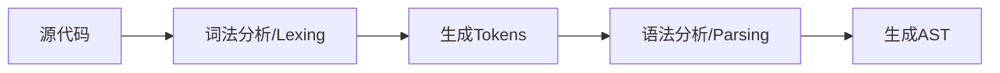
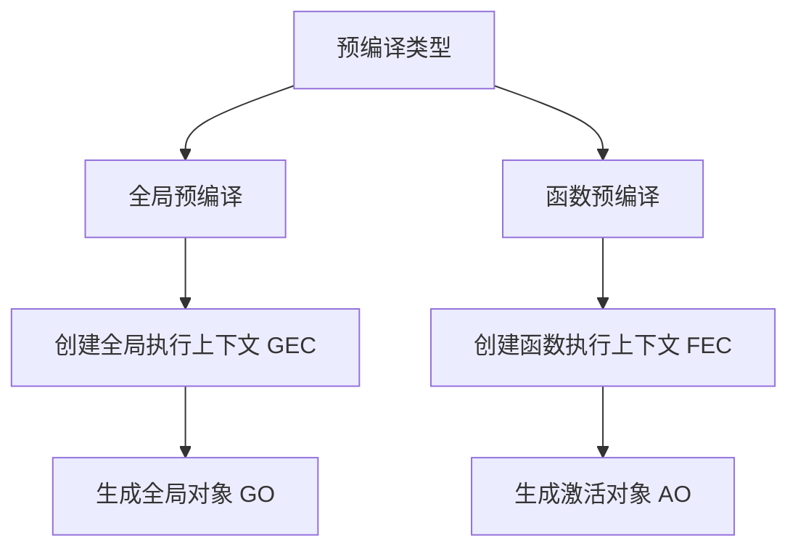
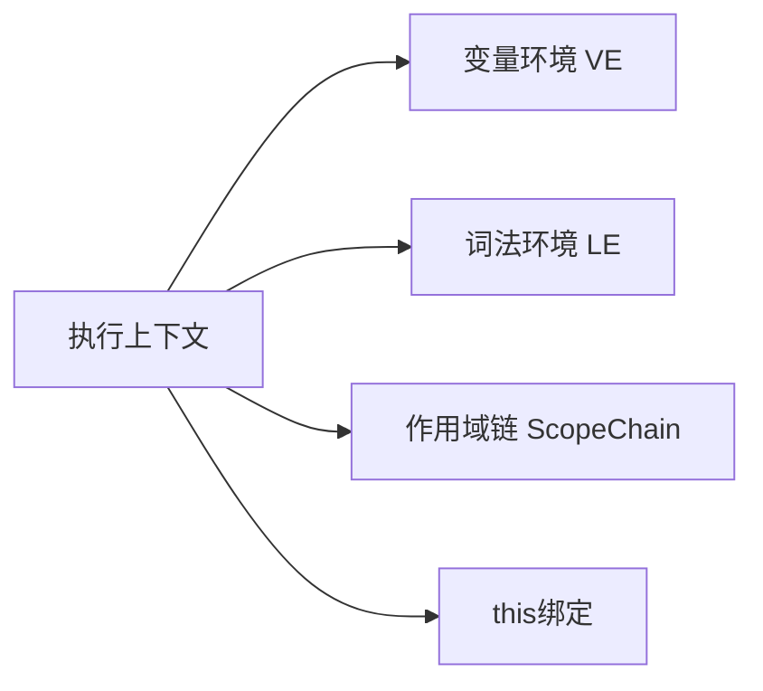

# JavaScript执行机制解析

## 前言

本篇将详细阐述 JavaScript 执行时候的三大阶段，我们重点要关注**预编译阶段**，这也是许多开发者容易产生困惑的地方。

阅读完本篇后，理解 JavaScript 底层执行原理，将使你从"知其然"进阶到"知其所以然"，后面再去学习闭包和作用域就容易多了。

## JavaScript运行三阶段

在浏览器中执行 JavaScript 代码时，引擎并非逐行直接执行代码，而是会经历三个关键阶段：

1. 语法分析（Syntax Parsing）
2. 预编译（Pre-Compilation）
3. 解释执行（Interpretation）

### 语法分析阶段（Syntax Parsing）

**核心任务**

将源代码转换为计算机可理解的抽象语法树（AST），主要流程：



**关键过程详解**

1. 词法分析（Lexing）
   
```javascript
// 原始代码
const x = 10 + 20;

// 生成的Tokens示例：
[
  { type: 'Keyword', value: 'const' },
  { type: 'Identifier', value: 'x' },
  { type: 'Punctuator', value: '=' },
  { type: 'Numeric', value: '10' },
  { type: 'Punctuator', value: '+' },
  { type: 'Numeric', value: '20' },
  { type: 'Punctuator', value: ';' }
]
```

2. 语法分析（Parsing）

- 使用 [递归下降算法](https://zh.wikipedia.org/zh-hans/%E9%80%92%E5%BD%92%E4%B8%8B%E9%99%8D%E8%A7%A3%E6%9E%90%E5%99%A8) 构建AST
- 验证语法合法性
- 生成标准ESTree结构

::: info
很可惜，我对递归下降算法也没有研究的很透彻，留待以后吧😀
:::

3. AST示例

```json
{
  "type": "Program",
  "body": [
    {
      "type": "VariableDeclaration",
      "declarations": [
        {
          "type": "VariableDeclarator",
          "id": { "type": "Identifier", "name": "x" },
          "init": {
            "type": "BinaryExpression",
            "left": { "type": "Literal", "value": 10 },
            "operator": "+",
            "right": { "type": "Literal", "value": 20 }
          }
        }
      ],
      "kind": "const"
    }
  ]
}
```
语法分析阶段还会检测 ​SyntaxError 这类语法错误。语法错误均在 **​代码执行前** 被检测到。引擎在生成抽象语法树（AST）时，若发现结构不合法，会立即抛出错误并终止后续流程。

> [!NOTE] 重要
> 这种错误有点类似于 Java 等编译前错误。实际上现在语言已经不能简单归类编译型和解释型，大部分都会进行编译、执行前扫描优化。

注意这类错误发生在运行前，我们是无法用try...catch 能捕获到这类错误的。

```js
try {
  eval('function() {}'); // 语法错误
} catch (e) {
  // 此处代码不会执行
}
```

因此，我们在控制台看到的这类错误总是提示 "Uncaught SyntaxError:....."

总的来说，语法分析阶段是 JavaScript 代码质量的第一道防线，所有 ​SyntaxError 均在此阶段被拦截，开发者需依赖工具提示和静态代码检查及时修复。

### 预编译阶段（Pre-Compilation）

预编译阶段发生在代码执行前，是JavaScript最独特的机制，决定了**变量提升**、**作用域链**等核心特性的行为模式。理解这个阶段，就能解开90%的"诡异"代码现象。​

这一阶段 JavaScript 引擎采用分层编译策略完成核心任务：
   - 全局预编译 
   - 函数预编译



在了解这2个预编译过程之前，我们要先了解一下 **执行上下文**。
::: tip 提示
执行上下文内容有点长，而且和它相关的概念比较多，做好心理准备😜
:::

#### 执行上下文栈（Execution Context Stack）

执行上下文栈，也就是**调用栈（Call Stack）**，是 JavaScript 引擎用于管理代码执行顺序的核心机制。它通过栈结构追踪函数的调用关系，确保代码在正确的作用域和上下文中执行。

并非只有函数执行才会生成上下文。总的来说，有下面几种情况：

1. 全局代码（Global Code）​
   1. 何时生成：脚本首次运行时
   2. ​特点：全局上下文是整个程序的入口，始终位于执行栈底部
2. 函数调用（Function Call）​
   1. ​何时生成：​每次调用函数时​（包括递归调用），无论函数是声明式、表达式还是箭头函数
   2. ​特点：函数上下文入栈执行，执行完毕后出栈
   ```js{6}
   function bar() {
    // 每次调用 bar() 时，生成新的执行上下文
    console.log("bar 执行中");
    }
    bar(); // 第一次调用，生成上下文
    bar(); // 第二次调用，再次生成新上下文 !!
    ```
3. eval 代码（极少使用）​
   1. 这种是执行字符串代码，会生成一个临时上下文
   2. 最好少用这种模式，不仅不安全，而且执行效率也不好

::: warning 警告
ES6 的块级作用域（Block Scope）不会生成执行上下文。这是很多人误解的地方。实际上，块级作用域通过 `​词法环境（Lexical Environment）`​ 管理，而非执行上下文栈。
:::

稍微总结一下：
| 场景               | 是否生成执行上下文 | 说明                             |
| ------------------ | ------------------ | -------------------------------- |
| 全局代码执行       | ✅                  | 仅生成一次，位于栈底             |
| 函数调用           | ✅                  | 每次调用生成新的上下文           |
| `eval()` 执行      | ✅                  | 临时上下文（不建议使用）         |
| 块级作用域（`{}`） | ❌                  | 通过词法环境处理，不触发上下文栈 |

::: details 扩展延申
- 在浏览器环境中，多个 `<script>` 标签加载的脚本默认情况下是共享同一个全局执行上下文的，他们共享全局变量
- 即使脚本来自不同域，只要加载到页面中，仍共享同一全局上下文（受同源策略限制的是数据请求，而非脚本执行）
- 模块化脚本（type="module"）首次加载会创建独立执行上下文，​不共享全局变量。但是其他模块导入同一个模块时候，会复用已有模块实例，不会再来一个上下文
:::

执行上下文有下面几个关键部分组成：



- **​变量环境 Variable Environment**​：存储 var 声明的变量和函数声明（存在变量提升）
- **​词法环境 Lexical Environment**​：处理 let、const 声明的变量和块级作用域
- **​作用域链 Scope Chain**​：用于变量查找的链式结构
- ​**this 绑定**：指向当前执行环境的上下文对象

我们先来看下执行上下文的完整结构
```js
ExecutionContext = {
    // 变量环境组件：存储var声明的变量和函数声明
    VariableEnvironment: {
        // 环境记录：存储变量和函数声明的实际位置
        EnvironmentRecord: {
            Type: "Object",  // 用于全局上下文
            // 或者 Type: "Declarative" // 用于函数上下文
            // 绑定标识符
            bindings: {
                // 变量和函数声明都存储在这里
            }
        },
        outer: null  // 对外部环境的引用
    },

    // 词法环境组件：处理let/const声明和块级作用域
    LexicalEnvironment: {
        EnvironmentRecord: {
            Type: "Declarative",
            // 存储let、const声明
            bindings: {}
        },
        outer: null  // 对外部词法环境的引用
    },

    // this绑定
    ThisBinding: null,

    // 作用域链
    ScopeChain: []  // 由当前环境和所有外部环境的词法环境组成
}
```

下面是执行上下文的生成过程：


现在我们通过一个具体例子来说明这个过程。

::: code-group

```js [demo.js]
var name = 'global';
let age = 25;

function person() {
    var name = 'local';
    let hobby = 'coding';
    
    function displayName() {
        const type = 'inner';
        console.log(name, hobby, type);
    }
    
    displayName();
}

person();
```

```Pseudocode [全局执行上下文]
GlobalExecutionContext = {
    VariableEnvironment: {
        EnvironmentRecord: {
            Type: "Object",
            bindings: {
                name: "global",
                person: <function>
            }
        },
        outer: null
    },
    LexicalEnvironment: {
        EnvironmentRecord: {
            Type: "Object",
            bindings: {
                age: 25
            }
        },
        outer: null
    },
    ThisBinding: window,
    ScopeChain: [GlobalLexicalEnvironment]
}
```

```Pseudocode [person函数执行上下文]
PersonExecutionContext = {
    VariableEnvironment: {
        EnvironmentRecord: {
            Type: "Declarative",
            bindings: {
                name: "local",
                displayName: <function>
            }
        },
        outer: GlobalVariableEnvironment
    },
    LexicalEnvironment: {
        EnvironmentRecord: {
            Type: "Declarative",
            bindings: {
                hobby: "coding"
            }
        },
        outer: GlobalLexicalEnvironment
    },
    ThisBinding: window, // 默认绑定
    ScopeChain: [PersonLexicalEnvironment, GlobalLexicalEnvironment]
}
```

```Pseudocode [displayName函数执行上下文]
DisplayNameExecutionContext = {
    VariableEnvironment: {
        EnvironmentRecord: {
            Type: "Declarative",
            bindings: {}
        },
        outer: PersonVariableEnvironment
    },
    LexicalEnvironment: {
        EnvironmentRecord: {
            Type: "Declarative",
            bindings: {
                type: "inner"
            }
        },
        outer: PersonLexicalEnvironment
    },
    ThisBinding: window,
    ScopeChain: [DisplayNameLexicalEnvironment, PersonLexicalEnvironment, GlobalLexicalEnvironment]
}
```
:::

上面这段代码会创建3个执行上下文。 首先，进入全局代码生成全局上下文，在 `person()` 函数调用的时候生成person函数的执行上下文，再依次生成 `displayName()` 函数的执行上下文。

这里一定要注意的是：函数 **执行** 才会生成上下文 ❗❗

::: warning 警告
真实的执行上下文是引擎内部实现机制，无法直接用代码访问，
:::

::: tip 个人建议
执行上下文了解下其结构和生成顺序即可，不是相关领域研究者不需要深究，毕竟是js引擎内部实现
:::

#### 全局预编译

了解了上面的执行上下文概念后，我们理解全局预编译就容易多了。

**​触发时机**：脚本加载时立即执行

**​核心产出**：
- 创建全局执行上下文（Global Execution Context, GEC）
- 生成全局对象（Global Object，浏览器中即 window）

**主要工作**：
- 扫描所有 var 声明的全局变量（初始值为 undefined）
- 处理函数声明（整体提升）
- 建立全局作用域链

##### GO创建过程

 1. 创建GO对象

```js
GO = {
    // 内置属性和方法
    window: this,
    document: {},
    Array: function(){},
    Object: function(){},
    String: function(){},
    Boolean: function(){},
    Date: function(){},
    Math: {},
    // ... 其他内置属性和方法
}
```

 2. 处理变量声明（var）

```js
// 找到所有var声明，添加到GO中并初始化为undefined
var a = 1;
var b = function() {};
// 变为：
GO = {
    // ...内置属性
    a: undefined,
    b: undefined
}

// 3. 处理函数声明
function test() {}
// 变为：
GO = {
    // ...内置属性
    test: function test() {}
}
```

全局执行上下文和全局对象是什么关系？

其实如果你细心的话，上面的伪码已经给出了答案：

```js
// 全局执行上下文
GlobalExecutionContext = {
    VariableEnvironment: {
        EnvironmentRecord: GO,    // 指向全局对象
        outer: null
    }
}
```

因此全局变量实际上是GO的属性!

