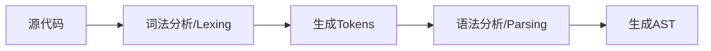
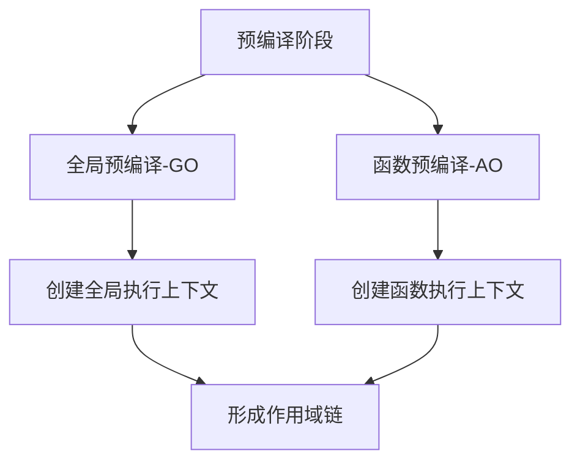
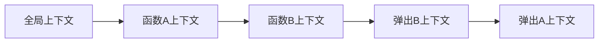

# JavaScript执行机制解析

## 前言

本篇将详细阐述 JavaScript 执行时候的三大阶段，我们重点要关注**预编译阶段**，这也是许多开发者容易产生困惑的地方。

阅读完本篇后，理解 JavaScript 底层执行原理，将使你从"知其然"进阶到"知其所以然"，后面再去学习闭包和作用域就容易多了。

## JavaScript运行三阶段

在浏览器中执行 JavaScript 代码时，引擎并非逐行直接执行代码，而是会经历三个关键阶段：

1. 语法分析（Syntax Parsing）
2. 预编译（Pre-Compilation）
3. 解释执行（Interpretation）

### 语法分析阶段（Syntax Parsing）

**核心任务**

将源代码转换为计算机可理解的抽象语法树（AST），主要流程：



**关键过程详解**

1. 词法分析（Lexing）
   
```javascript
// 原始代码
const x = 10 + 20;

// 生成的Tokens示例：
[
  { type: 'Keyword', value: 'const' },
  { type: 'Identifier', value: 'x' },
  { type: 'Punctuator', value: '=' },
  { type: 'Numeric', value: '10' },
  { type: 'Punctuator', value: '+' },
  { type: 'Numeric', value: '20' },
  { type: 'Punctuator', value: ';' }
]
```

2. 语法分析（Parsing）

- 使用 [递归下降算法](https://zh.wikipedia.org/zh-hans/%E9%80%92%E5%BD%92%E4%B8%8B%E9%99%8D%E8%A7%A3%E6%9E%90%E5%99%A8) 构建AST
- 验证语法合法性
- 生成标准ESTree结构

::: info
很可惜，我对递归下降算法也没有研究的很透彻，留待以后吧😀
:::

3. AST示例

```json
{
  "type": "Program",
  "body": [
    {
      "type": "VariableDeclaration",
      "declarations": [
        {
          "type": "VariableDeclarator",
          "id": { "type": "Identifier", "name": "x" },
          "init": {
            "type": "BinaryExpression",
            "left": { "type": "Literal", "value": 10 },
            "operator": "+",
            "right": { "type": "Literal", "value": 20 }
          }
        }
      ],
      "kind": "const"
    }
  ]
}
```
语法分析阶段还会检测 ​SyntaxError 这类语法错误。语法错误均在 **​代码执行前** 被检测到。引擎在生成抽象语法树（AST）时，若发现结构不合法，会立即抛出错误并终止后续流程。

> [!NOTE] 重要
> 这种错误有点类似于 Java 等编译前错误。实际上现在语言已经不能简单归类编译型和解释型，大部分都会进行编译、执行前扫描优化。

注意这类错误发生在运行前，我们是无法用try...catch 能捕获到这类错误的。

```js
try {
  eval('function() {}'); // 语法错误
} catch (e) {
  // 此处代码不会执行
}
```

因此，我们在控制台看到的这类错误总是提示 "Uncaught SyntaxError:....."

总的来说，语法分析阶段是 JavaScript 代码质量的第一道防线，所有 ​SyntaxError 均在此阶段被拦截，开发者需依赖工具提示和静态代码检查及时修复。

### 预编译阶段（Pre-Compilation）

预编译阶段发生在代码执行前，是JavaScript最独特的机制，决定了**变量提升**、**作用域链**等核心特性的行为模式。理解这个阶段，就能解开90%的"诡异"代码现象。​

这一阶段主要完成 全局预编译 + 函数预编译




1. 创建**执行上下文**：为即将执行的代码块创建执行环境
2. 确定**this指向**：绑定上下文对象
3. 建立**作用域链**：确定变量查找的路径
4. **变量和函数提升**：处理变量和函数声明


#### 执行上下文栈（Execution Context Stack）

执行上下文栈，也就是**调用栈（Call Stack）**，是 JavaScript 引擎用于管理代码执行顺序的核心机制。它通过栈结构追踪函数的调用关系，确保代码在正确的作用域和上下文中执行。



并非只有函数执行才会生成上下文。总的来说，有下面几种情况：

1. 全局代码（Global Code）​
   1. 何时生成：脚本首次运行时
   2. ​特点：全局上下文是整个程序的入口，始终位于执行栈底部
2. 函数调用（Function Call）​
   1. ​何时生成：​每次调用函数时​（包括递归调用），无论函数是声明式、表达式还是箭头函数
   2. ​特点：函数上下文入栈执行，执行完毕后出栈
   ```js{6}
   function bar() {
    // 每次调用 bar() 时，生成新的执行上下文
    console.log("bar 执行中");
    }
    bar(); // 第一次调用，生成上下文
    bar(); // 第二次调用，再次生成新上下文 !!
    ```
3. eval 代码（极少使用）​
   1. 这种是执行字符串代码，会生成一个临时上下文
   2. 最好少用这种模式，不仅不安全，而且执行效率也不好

::: warning 警告
ES6 的块级作用域（Block Scope）不会生成执行上下文。这是很多人误解的地方。实际上，块级作用域通过 `​词法环境（Lexical Environment）`​ 管理，而非执行上下文栈。
:::

稍微总结一下：
| 场景               | 是否生成执行上下文 | 说明                             |
| ------------------ | ------------------ | -------------------------------- |
| 全局代码执行       | ✅                  | 仅生成一次，位于栈底             |
| 函数调用           | ✅                  | 每次调用生成新的上下文           |
| `eval()` 执行      | ✅                  | 临时上下文（不建议使用）         |
| 块级作用域（`{}`） | ❌                  | 通过词法环境处理，不触发上下文栈 |


- 在浏览器环境中，多个 `<script>` 标签加载的脚本默认情况下是共享同一个全局执行上下文的，他们共享全局变量
- 即使脚本来自不同域，只要加载到页面中，仍共享同一全局上下文（受同源策略限制的是数据请求，而非脚本执行）
- 模块化脚本（type="module"）首次加载会创建独立执行上下文，​不共享全局变量。但是其他模块导入同一个模块时候，会复用已有模块实例，不会再来一个上下文


执行上下文有下面几个关键组成非常重要：

- **​变量环境 Variable Environment**​：存储 var 声明的变量和函数声明（存在变量提升）
- **​词法环境 Lexical Environment**​：处理 let、const 声明的变量和块级作用域
- **​作用域链 Scope Chain**​：用于变量查找的链式结构
- ​**this 绑定**：指向当前执行环境的上下文对象


