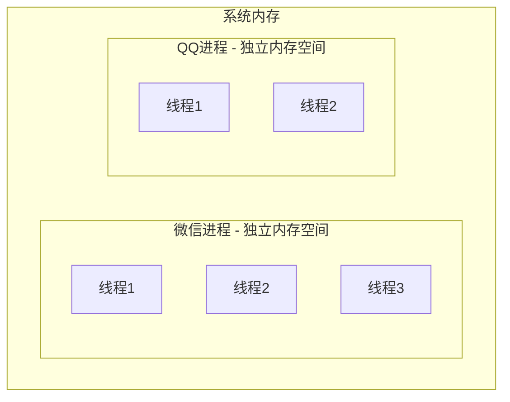
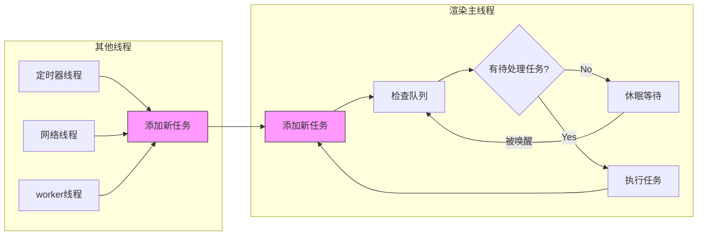

# 浏览器的渲染原理（上）-- 前置篇

## 前言

本篇为 合集（浏览器的渲染原理）的上篇，是全面了解浏览器的渲染原理的前置基础。内容主要包括浏览器的进程架构与事件循环的原理等基础知识。

通过本篇的学习，你将：

- [x] 学习进程线程和浏览器的进程架构等基础知识 
- [x] 了解渲染主线程的主要职责和工作特性
- [x] 掌握事件循环及异步任务的原理

### 合集目录

1. **浏览器的渲染原理（上）-- 前置篇**（当前篇）
   - 进程与线程 | 浏览器多进程架构 | 事件循环机制
   
2. **浏览器的渲染原理（中）-- 进阶篇**
   - HTML/CSS解析 | 样式计算 | 重排与重绘 | 图层合成

3. **浏览器的渲染原理（下）-- 网络篇**
   - Url的组成 | DNS解析 | TCP连接 | HTTP请求 | 响应状态码 | 缓存机制

## 前置知识

### 进程 与 线程：

进程是操作系统中最小的资源分配单位，每个进程都有一块自己独属的内存空间（进程之间相互独立）。每个进程至少包含一个线程（主线程）。

线程是操作系统能够进行运算调度的最小单位，一个进程可以包含多个线程，这些线程共享进程的内存空间。

示意图：



总之，用一个简单的比方来说明：进程就像是 一个工厂车间 （工作区），而线程就是一个个的车间工人，由他们来推动程序的运行。

## 浏览器的进程模型

现代浏览器（这里以Chrome为例）是一个 多进程、多线程 的非常复杂的应用程序。基于以下考虑，浏览器普遍采用 多进程 架构，并在启动运行时会创建多个不同职责的进程：

1. 进程隔离：当某个标签页或插件崩溃时，不会影响到浏览器的其他功能
2. 安全性：不同网站运行在独立的进程中，可以防止恶意网站访问其他网站的数据
3. 资源管理：更好的内存管理和资源分配
4. 性能优化：充分利用多核处理器的优势

::: tip 提示：
想要直观地看到浏览器的多进程架构，我们可以打开Chrome的任务管理器，点击右上角菜单 ⋮ -> 更多工具 -> 任务管理器（task manager）
:::


主要进程有：

1. 浏览器主进程（Browser Process）
   - 负责界面显示、用户交互、子进程管理
   - 管理书签、历史记录等用户数据
   - 负责各个页面的前进、后退、地址栏管理

2. 渲染进程（Renderer Process）
   - 负责将 HTML、CSS、JavaScript 转换为用户可以交互的网页
   - 每个标签页通常都会有独立的渲染进程，实现站点隔离
   - 运行 JavaScript 引擎（V8）处理 JavaScript 代码

3. GPU 进程（GPU Process）
   - 负责网页的图形绘制和硬件加速
   - 处理来自其他进程的绘制请求

4. 网络进程（Network Process）
   - 处理网络请求和响应
   - 实现网络协议（HTTP、HTTPS等）
   - 管理网络资源缓存

5. 插件进程（Plugin Process）
   - 负责控制网页使用的插件
   - 每种类型的插件对应一个进程，实现插件隔离

说明：

1. 浏览器主进程是第一个启动的进程，它会根据需要启动或关闭其他进程
2. 通常每个标签页会对应开启一个渲染进程（Process-per-tab）。但并不绝对，Chrome 曾使用过不同的进程模型 （process modal）。
   - Process-per-site: 来自同一站点的标签页共享渲染进程
   - Process-per-site-instance: 同源策略下的标签页共享渲染进程
   - 低端设备可能会降级使用共享进程模式以节省资源
3. GPU进程是浏览器的进程，不要与计算机的GPU硬件混淆
4. 渲染进程运行在沙箱中，限制了对系统资源的访问 （回想一下，网页是不是很难访问文件之类的？）

## 渲染主线程

渲染主线程(Main Thread)是渲染进程中 最重要、最核心 的线程，负责执行大部分渲染工作。它是本合集的重中之重。它的主要职责包括：

1. 解析工作：解析 HTML，解析 CSS
2. 页面布局：计算样式，处理页面布局变化，执行重排等
3. 页面绘制：处理重绘(repaint)操作，合成图层
4. 界面渲染，每隔 16.67ms 绘制一次 (每秒 60 帧)
5. 执行全局 js
6. 事件处理 （回调），如 点击 滚动等事件
7. 计时器 网络请求 回调等

从上面可以看出，渲染主线程承担着非常重要的职责，它需要处理HTML解析、样式计算、页面布局、绘制等多项任务。由于它的单线程特性，一旦某个任务执行时间过长，就可能导致其他任务被阻塞，最终造成页面卡顿。

那么，如何在保证渲染主线程正常工作的同时，又能处理那些可能耗时较长的任务呢？
浏览器采用了两个关键机制来解决这个问题：

1. **异步任务**：将耗时任务交给其他线程处理
2. **事件循环**：协调各类任务的执行顺序

让我们详细了解这两个机制是如何工作的。

## 异步任务

在JavaScript中，异步任务是指那些不能立即完成、需要等待一段时间才能得到结果的任务。为了不阻塞主线程，这些任务会被移交给其他线程处理，处理完成后再通过回调函数返回结果。

常见的异步任务类型：

1. **定时器任务**
   - setTimeout/setInterval 会交给定时器线程处理
   - 计时结束后，回调函数会被加入任务队列
   ```javascript
   setTimeout(() => {
     console.log('1秒后执行');
   }, 1000);
   ```

2. **网络请求**
   - AJAX、Fetch等网络请求由网络线程处理
   - 收到服务器响应后，回调会被加入任务队列
   ```javascript
   fetch('api/data')
     .then(response => {
       console.log('获取数据成功');
     });
   ```

3. **用户交互**
   - 点击、滚动等事件由其他线程监听
   - 事件触发时，回调函数进入任务队列
   ```javascript
   button.addEventListener('click', () => {
     console.log('按钮被点击');
   });
   ```

异步任务的执行流程：
1. 主线程遇到异步任务
2. 将任务移交给对应的线程处理
3. 主线程继续执行后续代码
4. 异步任务完成后，相关回调被加入任务队列
5. 主线程通过事件循环机制执行队列中的回调

这种机制确保了耗时操作不会阻塞主线程的执行，从而保证了页面的响应性能。

## 事件循环

事件循环（Event Loop， 或者 按W3C 标准叫 Message Loop）是渲染主线程用来处理大量任务的一种运行机制。由于主线程是单线程的，它通过队列来协调各种任务的执行顺序， 流程如下：

1. 渲染主线程进入无限循环状态
2. 检查消息队列是否有待处理的任务，如果有，取出任务并执行，如果没有，进入休眠状态等待被唤醒
3. 其他线程向队列添加任务时会唤醒主线程



任务没有优先级，都是按照队列的先进先出，但是队列有优先级。
根据w3c 规范:
- 相同类型任务必须放在同一个队列。比如，所有的 Promise 回调都进入微任务队列
- 不同类型任务可以在不同的队列。
- 浏览器必须维护至少一个微任务队列（microtask queue），且它执行优先级高于其他任务队列。这也意味着，当主线程空闲时，会优先清空微任务队列，然后才会执行其他队列中的任务

### 常见的任务队列类型及其任务：

| 队列类型       | 优先级 | 典型任务                                                                                             | 执行时机                 |
| -------------- | ------ | ---------------------------------------------------------------------------------------------------- | ------------------------ |
| 微任务队列     | 最高   | - Promise.then/catch/finally<br>- MutationObserver <br>- IntersectionObserver <br>- queueMicrotask() | 当前宏任务结束后立即执行 |
| 渲染前回调队列 | 次高   | - requestAnimationFrame                                                                              | 下一帧渲染前执行         |
| 交互事件队列   | 高     | - DOM事件(click/scroll)<br>- resize事件<br>- 媒体查询变化                                            | 事件触发时执行           |
| 网络请求队列   | 中     | - AJAX/Fetch 回调<br>- WebSocket 消息<br>- Server-Sent Events                                        | 收到响应后执行           |
| 定时器队列     | 中     | - setTimeout<br>- setInterval                                                                        | 计时器到期后执行         |
| 空闲回调队列   | 低     | - requestIdleCallback                                                                                | 浏览器空闲时执行         |


## 总结回顾

本章我们学习了浏览器的多进程架构如何通过进程隔离提升稳定性，并了解到渲染主线程通过事件循环机制高效调度任务。

### FAQ

#### 问： 一段 JavaScript 代码改变dom元素的内容然后死循环几秒，界面会及时渲染新内容吗？

答：不会，改变了dom属性值，界面要得到更新需要渲染主线程刷新帧（60/s）, 但是由于 此时主线程阻塞在死循环，所以会卡住，几秒后再更新。 这个必须对事件循环和异步有较深的理解 （记住，主线程很繁忙，要一直画帧）

#### 想一想：`setInterval` 定时是精确的吗？结合本章内容尝试回答？

答：由于**事件循环机制**定时器无法实现精确的定时：
   - JavaScript 是单线程的，所有任务都在主线程中执行。
   - 事件循环机制决定了任务的执行顺序和时机。
   - 如果主线程被长时间任务阻塞，计时器回调的执行时间可能会被延迟。

---
下一章将深入解析渲染流水线的具体步骤。
