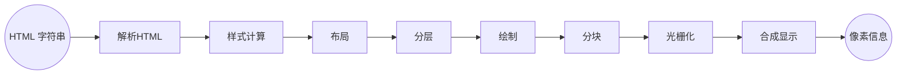
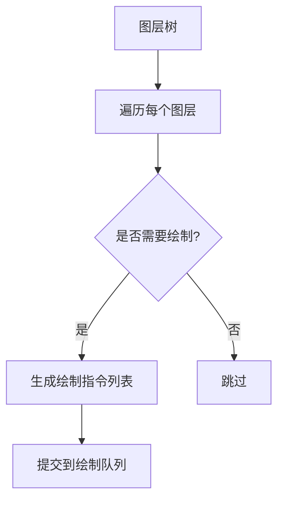

# 浏览器的渲染原理（中）-- 进阶篇

## 前言

本篇为 合集（浏览器的渲染原理）的下篇，前面一篇我们已经对浏览器进程架构和事件循环等概念有了初步掌握。本篇将深入探讨浏览器渲染管线的完整工作流程。

通过本篇的学习，你将：

- [x] 了解渲染管线的全部环节：从HTML解析到像素显示的全过程
- [x] 深入理解回流、重绘等核心概念
- [x] 通过文末的问答来加深掌握本章知识

> [!TIP] 阅读建议
> 建议按顺序阅读全文，重点关注渲染流程的各个环节及其相互关系。对于已有基础知识的读者，可以直接跳转到感兴趣的章节。

### 合集目录

1. **浏览器的渲染原理（上）-- 前置篇**
   - 进程与线程 | 浏览器多进程架构 | 事件循环机制
   
2. **浏览器的渲染原理（中）-- 进阶篇**（当前篇）
   - HTML/CSS解析 | 样式计算 | 重排与重绘 | 图层合成

3. **浏览器的渲染原理（下）-- 网络篇**
   - Url的组成 | DNS解析 | TCP连接 | HTTP请求 | 响应状态码 | 缓存机制


## 什么是浏览器渲染？

答：浏览器渲染指的是 将 **html字符串** 转化为**像素信息**的过程

> [!NOTE] 重要
> **渲染（render）**，在不同的 语境（context）下含义不同，浏览器渲染不是游戏显卡的渲染，更不要和 vue或者react 中的 render 混淆！

## 渲染设计到的2个方面
1. 网络通信，本篇不涉及到这方面的知识
2. 渲染，浏览器的网络进程拿到 html 后，产生的一个渲染任务， 渲染主线程取出队列中的任务，开始渲染流程

## 渲染流程的几个环节：



### HTML 解析（Parse）

在解析 html 的时候，遇到标签就解析标签，遇到 css 就解析css，遇到 js 就执行。另外现代浏览器还会启动一个 预解析线程 扫描后续的HTML，发现需要下载的资源（如脚本、图片）就会提前开始下载。

当遇到 `<script>` 标签（外部js）时候，会停止并等待资源下载完成，再执行全局 js。这是因为 js 可能会修改 DOM

> [!IMPORTANT]
> 这是 js 会阻塞 html 解析的根本原因！！

当遇到 link 标签（这里以外部css为例）时候，解析工作并不会停止等待，因为这个部分是由 预解析线程 下载并解析的

> [!IMPORTANT]
> 这是 css解析 不会阻塞 html 解析的根本原因！！

> [!TIP]
> 注意最终 `CSSOM (CSS Object Model)` 还是在主线程生成， 预解析线程只是协助

解析过程中，会将标记转变为 DOM 节点，根据标记类型（标签开始、属性、文本、标签结束）创建对应的节点对象

- 元素节点：如 `<div>` 生成 HTMLDivElement 实例
- 文本节点：如 Hello 生成 TextNode 实例
- 注释节点：如 `<!-- comment -->` 生成 Comment 实例

最终 会得到一个树状结构的 `DOM (Document Object Model)` 

CSS 解析会将 CSS 规则转换为 `CSSOM (CSS Object Model)` 树，`CSSOM` 更像一个「规则集合」，CSSOM 由一系列 CSS 规则对象 组成，每个规则对应 CSS 文件中的一条选择器声明。例如：

::: code-group

```css [转换前]
/* 外部样式表 style.css */
body { font-size: 16px; }
.box { color: red; }
.box .title { font-weight: bold; }
```

```javascript [转换后]
CSSStyleSheet {
  cssRules: [
    CSSStyleRule {
      selectorText: "body",
      style: { fontSize: "16px" }
    },
    CSSStyleRule {
      selectorText: ".box",
      style: { color: "red" }
    },
    CSSStyleRule {
      selectorText: ".box .title",
      style: { fontWeight: "bold" }
    }
  ]
}
```
:::

浏览器默认样式，内部样式，外部样式，行内样式 都在 `CSSOM` 树中。这些对象实际是 C++ 对象，js 操作的实际是他们的包装对象

### 样式计算（Recalculate Style）

渲染主线程会遍历 `DOM` 树，依次为树中的节点生成 计算后样式（computed style）

#### 浏览器按照以下层叠逻辑来合并样式

1. 带有 !important 的声明始终优先
2. 根据选择器特异性（Specificity）的权重来比较
   1. 内联样式（style 属性）
   2. ID 选择器
   3. 类/伪类/属性选择器
   4. 元素/伪元素选择器
3. 浏览器默认样式表

#### 特异性权重的四个等级

CSS 选择器的特异性分为四个独立等级，按优先级从高到低排列：

| 等级                | 示例选择器          | 权重表示法      | 说明                     |
|---------------------|---------------------|-----------------|--------------------------|
| **内联样式**        | `style="color:red"` | `1-0-0-0`       | 直接写在元素上的样式     |
| **ID 选择器**       | `#header`           | `0-1-0-0`       | 每个 ID 选择器增加一级   |
| **类/伪类/属性**    | `.box`, `:hover`    | `0-0-1-0`       | 每个类、伪类或属性选择器 |
| **元素/伪元素**     | `div`, `::before`   | `0-0-0-1`       | 每个标签或伪元素选择器   |

#### 计算样式具体值

将相对单位、百分比等转换为可直接用于渲染的绝对值，比如：
- 单位转换：如 em → px、rem → px、% → px（需结合父元素或视口尺寸）
- 颜色转换：将 hex、hsl 等格式统一为 rgba
- 计算后的所有样式属性都**必须有值**

> [!TIP] 想一想
> 那些没有显式赋值的样式属性计算后的值是从哪里来的呢？

### 布局（Layout）

在完成样式计算后，浏览器会进入布局阶段，这一步的核心目标是：依次遍历 DOM 树，再结合计算后的样式，确定每个元素在屏幕上的 几何位置 和 尺寸，最终生成 **布局树（Layout Tree）**。

布局树由 DOM 树和 CSSOM 树结合生成，但与 DOM 树并不一定会一一对应。

| 特性             | DOM 树                                  | 布局树（Layout Tree）                          |
|------------------|-----------------------------------------|-----------------------------------------------|
| **节点类型**     | 包含所有节点（包括不可见元素）           | 仅包含可见元素（如过滤 `display: none` 的节点） |
| **几何信息**     | 无                                      | 存储位置、尺寸等几何信息（如 width, height, x, y） |
| **层级结构**     | 反映 HTML 嵌套关系                      | 反映渲染层级，可能包含额外生成的匿名盒子（如处理浮动） |

> [!TIP] 想一想
> - 布局树中有伪元素对应节点吗？
> - 布局树中有 `head` 元素节点吗？如果有/无，为什么呢？

#### 布局计算的核心步骤

1. 从根节点开始递归（通常是 `<html>`）开始，递归遍历所有子节点。

2. 计算盒子模型（Box Model），根据 CSS 的盒模型规则，计算每个元素的：
   - 内容尺寸：width, height
   - 内边距：padding
   - 边框：border
   - 外边距：margin
   - 定位坐标：x, y（相对视口或父容器）

3. 处理复杂布局，对浮动（float）、绝对定位（position: absolute）、弹性布局（flex）、网格布局（grid）等复杂情况，调整子元素的几何位置

### 分层（Layer）

为了提高绘制效率，现代浏览器会使用一套复杂的策略将页面划分为多个独立图层，减少后续绘制和更新的范围。通过分层，浏览器可以仅重绘特定图层（如动画元素），而非整个页面，从而显著提升渲染性能。

相应的，分层阶段也会生成一个 **图层树（Layer Tree）**

::: info
- 你可以进入 Chrome DevTools → More tools → Layers 面板查看页面的 分层 可视化结构
- 也可以进入 rendering 面板查看元素的分层边界
:::

#### 哪些属性会影响分层？

以下 CSS 属性或行为可能导致浏览器创建新的合成层，但并非绝对（浏览器可能根据上下文优化）：

| 属性/行为                                                                 | 说明                                                                                                                                                                                                 |
|---------------------------------------------------------------------------|------------------------------------------------------------------------------------------------------------------------------------------------------------------------------------------------------|
| **`transform: translate(0)`**                                             | 强制触发 GPU 加速，创建独立合成层（经典的分层技巧）                                                                                                                                                 |
| **`will-change`**                                                         | 主动声明未来会变化的属性（如 `will-change: transform`），浏览器预分配独立层                                                                                                                          |
| **`opacity < 1`**                                                         | 半透明元素可能被提升为独立层，优化透明度动画性能                                                                                                                                                     |
| **`filter`**                                                              | 应用模糊(`blur()`)、阴影(`drop-shadow()`)等滤镜时自动分层                                                                                                                                             |
| **`position: fixed`**                                                     | 固定定位元素滚动时脱离文档流，常被分层以避免回流                                                                                                                                                     |
| **`overflow: scroll`**                                                    | 滚动容器（尤其移动端设置 `-webkit-overflow-scrolling: touch` 时）触发分层                                                                                                                           |
| **`<video>` / `<canvas>` / `<iframe>`**                                   | 多媒体元素默认分层以实现硬件加速渲染                                                                                                                                                                 |
| **3D Transforms**                                                         | 使用 `rotate3d()` `matrix3d()` 等 3D 变换属性强制分层                                                                                                                                                |
| **`backface-visibility: hidden`**                                         | 隐藏元素背面时可能触发分层优化                                                                                                                                                                       |
| **`mix-blend-mode`**                                                      | 混合模式（如 `multiply`）需要独立层进行颜色计算                                                                                                                                                      |
| **`clip-path`**                                                           | 非矩形裁剪路径可能触发分层                                                                                                                                                                           |
| **`mask` / `mask-image`**                                                 | 遮罩效果需要独立层处理叠加关系                                                                                                                                                                       |
| **`perspective`**                                                         | 设置透视视图（即使无 3D 变换）可能分层                                                                                                                                                               |
| **`isolation: isolate`**                                                  | 创建新层叠上下文，可能间接导致分层                                                                                                                                                                   |
| **`contain: paint`**                                                      | 声明渲染隔离时，浏览器可能优化为独立层                                                                                                                                                               |
| **CSS 动画/过渡**                                                         | 当动画涉及 `transform`/`opacity` 时，浏览器自动分层优化                                                                                                                                              |
| **`z-index`**                                                             | 高 `z-index` 元素在层叠上下文中可能被分层（需配合其他属性）                                                                                                                                           |
| **多列布局**                                                              | `column-count`/`column-width` 可能导致内容分层渲染                                                                                                                                                   |
| **`-webkit-overflow-scrolling: touch`**                                   | 强制 iOS 容器启用硬件加速滚动并分层                                                                                                                                                                  |
| **高频重绘元素**                                                          | 浏览器可能自动将频繁变化的元素提升为独立层（隐式分层）                                                                                                                                               |
| **`box-shadow`** (大规模使用)                                             | 大量阴影动画可能间接导致分层（需谨慎使用）                                                                                                                                                          |

#### 分层是一定发生的吗？

不一定。浏览器会根据以下因素决定是否分层：

- 元素可见性：隐藏的元素（display: none）或尺寸为 0 的元素不会被分层
- 重叠与合成成本：如果分层后合成成本高于直接绘制，浏览器可能合并图层
- 硬件限制：设备内存或 GPU 能力不足时，浏览器可能减少分层
- 浏览器优化策略：不同浏览器（Chrome、Firefox、Safari）的分层策略可能不同。

#### 分层的好处与代价

优点：
- 减少重绘：独立图层变化时，只需重绘该层，无需影响整个页面
- 硬件加速：利用 GPU 合成图层，提升动画和滚动的流畅度
  
代价：
- 内存占用：每个层需要额外的内存存储位图
- 过度分层：过多的层可能导致合成时间增加，反而降低性能（层爆炸问题）

> [!WARNING]
> - 避免滥用 will-change/transform 等：过度使用可能导致内存泄漏，用完可重置（如 will-change: auto）
> - 隐式分层：如 filter 和 opacity 可能导致意外分层，注意性能影响

### 绘制（Paint）

绘制阶段是渲染流程中承上启下的关键环节，其核心任务是 将分层后的图层转换为一系列绘制指令，这一阶段不直接生成像素，而是生成如何绘制像素的指令列表。

#### 绘制指令列表（Paint List）

每个图层对应一个绘制列表，包含一系列 绘制操作命令。这些指令类似于 Canvas 2D 的绘图 API，描述如何将元素绘制到图层上。

绘制流程大致如下：



浏览器会通过 **脏矩形算法（Dirty Rectangles）** 仅重绘变化区域，以便减少工作量。

以下 CSS 属性会增加绘制（Paint）指令的复杂性，导致更高的渲染成本，尤其是在频繁更新或复杂视觉效果的情况下：

1. 阴影与模糊效果
2. 复杂形状与裁剪，包括 border-radius、mask-image 及其他裁剪效果
3. 渐变
4. 混合，mix-blend-mode / background-blend-mode 等
5. 透明与叠加效果， 比如 opacity < 1 和 transform 等
6. 滚动和溢出

> [!NOTE] 重要
> 对上面的属性有个了解即可，开发的时候可以使用 Chrome DevTools 的 「Render」或 「Performance」→「Paint flashing」 功能检测过度绘制区域（绿色闪烁）

这一步完成后，主线程会将每个图层的绘制信息 传递给 合成线程

### 分块（Tiling）

分块阶段主要在浏览器的 合成器线程（Compositor Thread） 中完成，而非渲染主线程。

分块的核心目标是将大型图层拆分为多个小图块（Tile），以便高效利用 GPU 资源。通过分块，浏览器可以并行处理多个小块，并仅更新可见区域的图块，从而显著提升渲染性能。

浏览器根据设备性能动态调整分块尺寸：

- 高性能设备：使用更大的图块（如 512x512），减少图块数量。
- 低性能设备：使用更小的图块（如 256x256），提升并行效率。

合成器线程将大型图层分割成小图块后，生成 **图块列表（Tile List）**

### 光栅化（Rasterization）

光栅化是将图块（Tile）的绘制指令转换为实际像素位图的关键步骤。光栅化由 **光栅化线程池（Raster Thread Pool）** 执行，与合成器线程协作：

- 合成线程会将块信息交给 GPU 进程，GPU进程会开启多个线程（光栅化线程池）以极高的速度来完成光栅化
- 合成器线程：负责调度光栅化任务，管理图块优先级
- 光栅化线程池：多个线程并行处理不同图块（数量通常等于 CPU 核心数）

> [!IMPORTANT] 注意
> 这里的 GPU 进程 指的是浏览器软件的进程，不是显卡的 GPU。前面一章我们已经说了，浏览器每个标签页的渲染进程其实在沙盒中运行，所以这里会转交给gpu进程来沟通硬件

#### 光栅化任务的调度策略

1. 视口优先（Viewport Prioritization），优先光栅化可见区域的图块，快速呈现首屏内容
2. 增量光栅化（Incremental Raster），若图块内容部分更新，仅重新光栅化脏区域（Dirty Rect）
3. 纹理缓存（Texture Cache），GPU 缓存常用图块纹理（如重复背景图），避免重复光栅化

光栅化的最终结果是 每个图块（Tile）对应的像素位图（Bitmap），这些位图以 纹理（Texture） 的形式存储在 GPU 内存 中，供后续的合成阶段使用。

### 合成（Composite）

合成是浏览器渲染流程的最终阶段，其核心任务是 将光栅化后的图块（Tile）合成为完整的屏幕图像，并通过 GPU 硬件加速实现高效绘制。这一阶段直接决定了用户所见的最终画面，是浏览器实现流畅交互（如滚动、动画）的关键环节。

这一阶段由 合成线程 来执行，它根据得到的位图信息，生成 Quad（就是每个位图的 指引信息，指引位图画到屏幕哪个位置，会考虑到 transform 等）。然后 GPU进程 通过 系统调用 驱动硬件最终刷新显示屏形成用户看到的图像！！

::: details 什么是quad？
quad是包含以下元数据的结构体（伪代码表示）：
```cpp
struct Quad {
  vec2[4] position;    // 四边形顶点坐标（屏幕空间）
  vec2[4] texCoords;   // 纹理坐标（对应图块位置）
  mat4 transform;       // 变换矩阵（旋转/缩放等）
  float opacity;        // 透明度
  Texture texture;      // 关联的图块纹理
};
```
:::

#### 触发合成的 CSS 属性

以下属性修改会跳过布局和绘制阶段，直接触发合成：

```css
.element {
  transform: translateX(100px) rotate(30deg); /* 触发合成 */
  opacity: 0.5;                               /* 触发合成 */
  will-change: transform;                     /* 预分配图层 */
}
```

至此，浏览器渲染流程的所有环节已全部讲诉完毕。下面我们来讨论2个相关的经典知识点：回流 与 重绘

## 什么是回流？

回流（Reflow）​ 是指浏览器重新计算页面上元素的 ​几何属性（位置、尺寸）​ 并更新布局树（Layout Tree）的过程。

当元素的布局属性（如宽度、高度、边距）发生变化，或 DOM 结构发生变动时，浏览器必须重新计算元素的几何信息，以确保页面正确渲染。

为了避免连续多次操作导致反复计算, 浏览器会合并这些操作 等它们都完成了再计算，所以这一步其实是**异步**的。

::: details 想一想
React 中 setState 是同步的还是异步的？
:::

采用异步固然少了很多不必要的计算，但同时也带来了一个问题：js 获取 布局属性 可能无法及时获取更新后值

最终决定：当读取那些影响元素几何信息的 dom 属性时候，就会立即去回流（同步）

### 哪些操作会强制浏览器触发回流？

| 触发场景               | 示例                                                                 |
|------------------------|----------------------------------------------------------------------|
| 修改元素几何属性       | width、height、margin、padding、border 等属性变化。                 |
| 改变窗口尺寸           | window.resize 事件触发。                                            |
| DOM 结构变化           | 新增/删除元素、修改 `display: none` 或 `visibility: hidden`。        |
| **读取布局属性**           | offsetTop、offsetLeft、clientWidth 等属性被访问。                   |
| 字体或内容变化         | 文本内容改变、字体大小调整                                           |

### 回流的性能代价

回流是渲染流程中 ​性能开销最大 的环节，原因如下：

- 计算复杂度高：需要递归遍历布局树，计算所有受影响元素的几何属性
- ​连锁反应：一个元素的回流可能导致父级、子级甚至兄弟元素一起回流
- ​阻塞主线程：回流是在主线程中，频繁操作会导致页面卡顿

### 减少回流的一些实践

- 尽量 批量读写样式，而不是在循环中交替修改和读取布局属性
  
```javascript
// ❌ 错误示例：每次循环触发回流
for (let i = 0; i < 10; i++) {
  element.style.width = `${i * 10}px`;
  console.log(element.offsetWidth); // 强制同步回流
}

// ✅ 正确示例：批量操作
let width = element.offsetWidth; // 先读取
for (let i = 0; i < 10; i++) {
  width = i * 10;
}
element.style.width = `${width}px`; // 最后修改
```

- 做位移动画时候，尽量用 transform 代替 top/left 等
- 使用 DocumentFragment 来批量插入节点

```javascript
const fragment = document.createDocumentFragment();
for (let i = 0; i < 100; i++) {
  const li = document.createElement('li');
  fragment.appendChild(li);
}
document.getElementById('list').appendChild(fragment); // 仅一次回流
```

- 使用 Flexbox/Grid 布局来代替以前的那种 浮动布局

::: info 提示
​Chrome DevTools → Rendering → Layout Shift Regions：高亮显示导致回流的区域。
:::

## 什么是重绘？

重绘（Repaint）​是指当元素的 ​视觉样式发生改变但不影响布局时，浏览器重新绘制受影响区域的像素信息的过程。重绘不会触发布局（Layout）计算，仅更新屏幕显示

重绘的本质是重新生成绘制指令。当改动了可见样式，就需要重新生成指令，从而引发重绘

### 哪些操作会触发重绘（但不会触发回流）？

| 触发场景         | 示例                                                                                     |
|------------------|------------------------------------------------------------------------------------------|
| 颜色相关属性     | color、background-color、border-color、outline-color 等修改                                |
| 视觉效果属性     | visibility、opacity（部分浏览器可能触发合成）、box-shadow 等变化                           |
| 背景样式         | background-image、background-size、background-position 等调整                             |
| 边框样式         | border-radius、border-style 等非尺寸相关的修改                                            |

## 重绘与回流的关系

- ​回流必然触发重绘：布局变化后，浏览器必须重新绘制受影响的区域
- 重绘独立于回流：仅修改视觉样式时，直接跳至绘制阶段，无需重新布局

## FAQ

### 问：为什么 transform 效率高?

**答**：transform 和 opacity，这些属性由 ​合成器线程（Compositor Thread）直接处理，不影响布局也不影响绘制，不会干扰到渲染主线程。

> [!TIP] 惊讶
> 滚动条也是一种transform！！ 是不是很少看到滚动卡顿的？

~~ 🌼 完结 撒花 🌼 ~~
