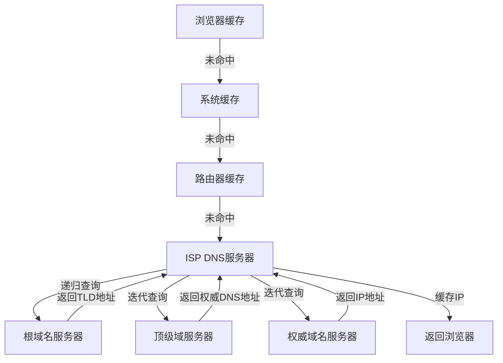

# 浏览器从输入Url到页面渲染

## 前言

浏览器从输入Url到页面渲染的过程，涉及到网络、浏览器、服务器等多个环节，本文将完整介绍这一过程。

通过本篇的学习，你将：

- [x] 掌握 URL 各组成部分的含义
- [x] 理解DNS域名解析的过程
- [x] 理解TCP/IP协议的工作过程
- [x] 理解HTTP协议的工作过程
- [x] 理解浏览器渲染页面的过程（下一篇）

### 合集目录

1. **浏览器的渲染原理（上）-- 前置篇**
   - 进程与线程 | 浏览器多进程架构 | 事件循环机制
   
2. **浏览器的渲染原理（中）-- 进阶篇**
   - HTML/CSS解析 | 样式计算 | 重排与重绘 | 图层合成

3. **浏览器的渲染原理（下）-- 网络篇**（当前篇）
   - Url的组成 | DNS解析 | TCP连接 | HTTP请求 | 响应状态码 | 缓存机制

## URL 的组成

### 基本格式
```text
  https://www.example.com:8080/path/to/page?name=Youzi&age=20#section1
  \___/   \_____________/ \__/\___________/ \______________/ \_______/
    |           |           |       |               |           |
  协议    域名/主机名     端口号    路径          查询参数        锚点
```

### 各组成部分详解

#### 1. 协议（Protocol）
URL的开头部分，用于指定访问资源时所使用的通信协议。
- 定义通信规则（如 `http`, `https`, `ftp`）
- 示例：`https://`（加密的 HTTP 协议）

#### 2. 域名（Domain）
- 由一串用点分隔的单词组成，通常最后一个词表示域名的顶级域（TLD）
- 层级结构：
  ```text
  www    . example  . com  . 
  └─子域名   └─主域名    └─顶级域
  ```

#### 3. 端口（Port）
用于区分同一服务器上的不同服务，不同的服务通常使用不同的端口号。HTTP的默认端口是80，而HTTPS的默认端口是443。
- 端口号范围：0~65535
- 默认端口自动隐藏：
  - HTTP → 80
  - HTTPS → 443
- 省略默认端口：
  - HTTP → `http://www.example.com`
  - HTTPS → `https://www.example.com`
- 省略非标准端口：
  - HTTP → `http://www.example.com:80`


#### 4. 路径（Path）
 用于指定访问资源的路径，通常以 `/` 开始，表示当前所在的目录
- 使用 `/` 分隔层级：
  ```markdown
  /articles/2023/url-guide.html
  ```

#### 5. 查询参数（Query Parameters）
用于指定附加信息，如搜索词、分页信息等
- 格式规则：
  - 以 `?` 开始
  - `key=value` 键值对
  - 多个参数用 `&` 连接
  ```markdown
  ?category=tech&page=2
  ```

#### 6. 锚点或片段标识符（Fragment）
用于定位页面内的特定位置
- 定位页面内锚点：
  ```markdown
  #chapter2
  ```

### 完整示例解析
```javascript
// 浏览器解析示例
const url = new URL('https://www.xinfei.fun:443/docs/network?type=guide#http');
console.log(url.protocol);  // → "https:"
console.log(url.hostname);  // → "www.xinfei.fun"
console.log(url.pathname);  // → "/docs/network"
console.log(url.search);    // → "?type=guide"
console.log(url.hash);      // → "#http"
```

> 提示：可通过浏览器开发者工具的 **Network** 面板观察实际请求的 URL 结构

## DNS域名解析

### 核心作用
将人类可读的**域名**转换为机器可识别的**IP地址**（如 `www.example.com` → `93.184.216.34`）

### 解析流程图


### 解析过程详解
#### 1. 本地缓存查询
浏览器会先检查自身缓存，看是否有之前解析过的域名的IP地址。
如果浏览器缓存中没有，则会检查操作系统缓存，比如Windows的hosts文件。
如果系统缓存中没有，则会检查路由器缓存。
- 浏览器缓存 → 系统缓存（hosts文件） → 路由器缓存
- 示例 hosts 记录:
```text
Windows路径: C:\Windows\System32\drivers\etc\hosts
127.0.0.1       localhost
::1             localhost
```

#### 2. ISP DNS服务器查询
如果路由器缓存中没有，则会向运营商的DNS服务器发出请求，获取域名的IP地址。
- 运营商的递归DNS服务器（如 114.114.114.114）
- 查询顺序：
  - 检查DNS缓存池
  - 发起递归查询（服务器代客户端完成整个查询过程）

#### 3. 根域名服务器查询（全球13组）
根域名服务器是最高层级的DNS服务器，负责管理顶级域服务器的IP地址。
- 返回对应顶级域服务器地址（如 .com TLD服务器地址）
- 可视化示例：
```text
www.example.com
→ 向根服务器查询
. 86400 IN NS h.root-servers.net.
→ 获得.com TLD服务器地址
```

#### 4. 顶级域（TLD）服务器查询
顶级域服务器管理各个二级域名服务器的IP地址。
- 返回权威DNS服务器地址（如 example.com 的NS记录）
- 示例记录：
```text
example.com
→ 向.com TLD服务器查询
example.com. 86400 IN NS ns1.example.com.
example.com. 86400 IN NS ns2.example.com.
```
#### 5. 权威域名服务器查询
权威域名服务器负责管理域名的IP地址，通常由域名注册商提供。
- 最终返回域名对应的IP地址（A记录）
- 示例记录：
```text
www.example.com
→ 向权威DNS服务器查询
www.example.com. 86400 IN A 192.168.127.12
```
#### 6. 递归查询
如果域名服务器收到请求，会向其他域名服务器查询，直到找到对应的IP地址。
#### 7. 迭代查询
如果域名服务器收到请求，会向其他域名服务器查询，直到找到对应的IP地址。
- 迭代查询的优点：
  - 减少网络流量
  - 减少DNS服务器负担
#### 8. 缓存IP
域名服务器会将IP地址缓存到本地，下次请求时直接返回。


