# Script 标签添加 defer 或 async 后有什么作用？

在 JavaScript 和 HTML 中，defer 和 async 是用于控制脚本加载和执行行为的两个属性，主要影响页面性能和脚本执行顺序。

下面我们将 浏览器处理 Script 的默认行为、加了defer、加 async 这3种情况分别讨论一下

## Script 标签既不加 defer 也不加 async

默认情况下，浏览器在遇到 Script 标签后，会暂停html解析转而开始下载js文件并执行。执行完成后又继续解析html。

::: info
现代浏览器通常会启动预解析线程下载js等资源文件，以便减少阻塞
:::

我们可以把这种情景称为**同步执行（Sync）**，大致流程如下：

```mermaid
gantt
    title Script标签同步执行行为图解
    dateFormat  S
    axisFormat %S s

    section HTML解析
    HTML解析前半段      :a1, 0, 2s
    HTML解析后半段      :a2, after a4, 3s

    section Script
    脚本下载阻塞HTML解析  :crit, a3, after a1, 3s
    脚本执行阻塞HTML解析  :crit, a4, after a3, 3s
```

## Script 标签加 defer 

defer 意味着 **延迟执行**，它的行为如下

- 脚本异步下载，不会阻塞 HTML 解析
- 脚本会在 ​HTML 解析完成后、DOMContentLoaded 事件之前执行
- 如果有多个 defer 脚本，那么就严格按照他们的声明顺序执行

```mermaid
gantt
    title Script标签加defer行为图解
    dateFormat  S
    axisFormat %S s

    section HTML解析
    HTML解析正常进行     :active, a1, 0, 40s
    解析完成             :done, a1_b, after a1, 0.5s
    DOMContentLoaded     :done, a4, after a2_e, 0.5s
    
    section Script下载
    脚本1异步下载         :active, a2, 0, 25s    
    
    section Script执行
    脚本执行阻塞解析 :crit, a2_e, after a1_b, 10s
```

适用场景：

- 需要操作 DOM 的脚本
- 多个脚本有依赖关系时（例如先执行库文件，再执行业务代码）

## Script 标签加 async 

async 意味着 **异步**，它的行为如下：

- 脚本异步下载，不会阻塞 HTML 解析
- 一旦下载完成，​立即执行脚本，此时会暂停 HTML 解析
- 多个 async 脚本的执行顺序不确定​（先下载完的先执行）

```mermaid
gantt
    title Script标签加async行为图解（修正版）
    dateFormat  S
    axisFormat %S s

    section HTML 解析
    HTML解析正常进行     :a1, 0, 5s
    js执行阻塞HTML解析       :crit, a1_block, after a1, 4s
    继续HTML解析     :a1_resume, after a1_block, 6s

    section Script
    异步并行下载脚本         :a2, 0, 5s

```

适用场景：

- 独立脚本，不依赖其他脚本或 DOM
- 例如：统计代码、广告脚本等

## 更多知识

1. 当script标签同时有async和defer属性时，async属性会优先，而defer会被忽略。这意味着脚本将按照async的行为来处理
2. 模块脚本（type="module"）​默认行为类似defer，但若同时设置async，模块会立即执行（类似普通脚本的async行为）